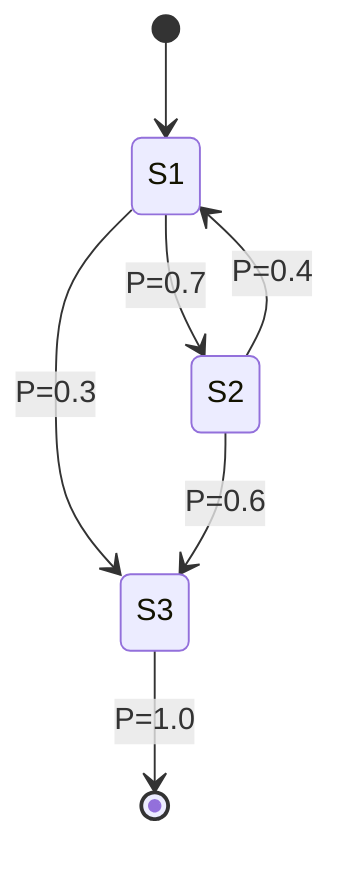

# 数学基础（RL 高频版）

> 不是数学大全，只列 **后面章节真正会用到** 的概念。看到对应符号能瞬间反应过来即可。

---

## 1. 期望与条件期望

强化学习的全部目标都可以写成一个期望：

$$
J(\pi) = \mathbb{E}_{\tau \sim \pi}\left[\sum_{t=0}^{\infty} \gamma^t r_t\right]
$$

**关键技巧**：全期望公式（Tower property）

$$
\mathbb{E}[X] = \mathbb{E}[\mathbb{E}[X \mid Y]]
$$

这是 Bellman 方程的核心。

---

## 2. 马尔可夫链

定义：$P(s_{t+1} \mid s_t, s_{t-1}, \ldots, s_0) = P(s_{t+1} \mid s_t)$

- **状态转移矩阵** $P \in \mathbb{R}^{|S| \times |S|}$
- **平稳分布** $\mu^T P = \mu^T$
- 在 RL 中演化为 **MDP**：加上 action 和 reward

> 马尔可夫链不仅是 RL 的理论基础，在传统算法里也广泛使用，例如 HMM（隐马尔可夫模型）、PageRank、自然语言模型等。

---

## 3. 贝叶斯推断（卡尔曼滤波视角）

$$
p(x_t \mid z_{1:t}) \propto p(z_t \mid x_t) \, p(x_t \mid z_{1:t-1})
$$

| 概念 | 定位中 | RL 中 |
|-----|--------|------|
| 先验 prior | 上一时刻位置 | 价值函数初始估计 |
| 似然 likelihood | GNSS 观测 | reward 信号 |
| 后验 posterior | 融合后位置 | 更新后价值 |

> **思考题**：DQN 的 target network 本质上类似什么滤波器思想？（提示：估计的稳定性）

---

## 4. 梯度与策略梯度（Log-Derivative Trick）

策略梯度的核心恒等式：

$$
\nabla_\theta \mathbb{E}_{x \sim p_\theta}[f(x)] = \mathbb{E}_{x \sim p_\theta}\left[ f(x) \nabla_\theta \log p_\theta(x)\right]
$$

**推导**（必须会手推）：

$$
\nabla_\theta \int p_\theta(x) f(x) \, dx
= \int \nabla_\theta p_\theta(x) f(x) \, dx
= \int p_\theta(x) \frac{\nabla_\theta p_\theta(x)}{p_\theta(x)} f(x) \, dx
= \mathbb{E}\left[ f(x) \nabla_\theta \log p_\theta(x)\right]
$$

这就是 REINFORCE / PPO / SAC 等所有策略梯度方法的根。

---

## 5. KL 散度

$$
D_{KL}(p \| q) = \sum_x p(x) \log \frac{p(x)}{q(x)}
$$

性质：
- $D_{KL} \geq 0$，等号成立当且仅当 $p = q$
- **不对称**：$D_{KL}(p\|q) \neq D_{KL}(q\|p)$

PPO/TRPO 用 KL 约束新旧策略的差异，防止策略更新太大导致崩溃。

---

## 6. 凸优化与拉格朗日

$$
\mathcal{L}(\theta, \lambda) = J(\theta) + \lambda \, g(\theta)
$$

- TRPO：把策略更新写成带 KL 约束的优化
- SAC：用拉格朗日乘子自动调节熵系数 α

---

## 7. 几个 RL 里超高频的小公式

| 名字 | 公式 | 用在哪 |
|-----|------|-------|
| 折扣回报 | $G_t = \sum_{k=0}^\infty \gamma^k r_{t+k}$ | 所有方法 |
| Bellman 期望方程 | $V^\pi(s) = \mathbb{E}[r + \gamma V^\pi(s')]$ | DP / TD |
| Bellman 最优方程 | $V^*(s) = \max_a \mathbb{E}[r + \gamma V^*(s')]$ | Q-learning |
| TD error | $\delta_t = r_t + \gamma V(s_{t+1}) - V(s_t)$ | 所有 TD 方法 |
| GAE | $\hat{A}_t = \sum_{l=0}^\infty (\gamma\lambda)^l \delta_{t+l}$ | PPO/A2C |

---

## 进一步阅读

- 张志华《矩阵分析与应用》
- Deisenroth《Mathematics for Machine Learning》（免费 PDF）
