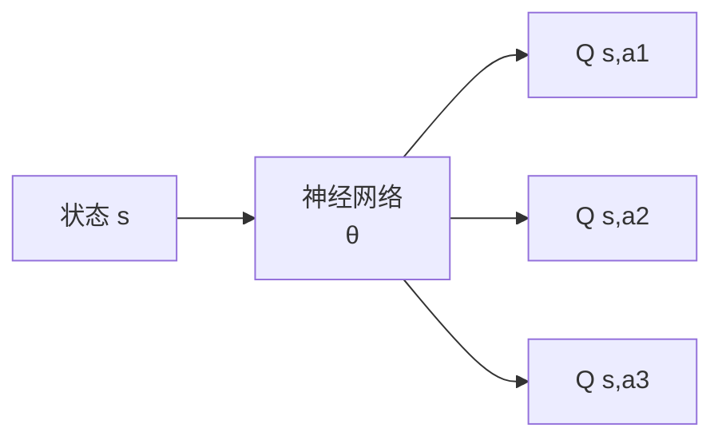

# ML 基础（RL 视角速通）

## 1. 神经网络作为函数近似器

在表格 RL 中，我们可以把 Q(s,a) 用一张表格存下来；但在 CartPole 这种连续状态空间，状态是无穷的，我们必须用一个**参数化函数**去近似：

$$
Q(s, a) \approx Q_\theta(s, a)
$$

这个 $\theta$ 就是神经网络的参数。



## 2. 反向传播只有 3 行

```python
optimizer.zero_grad()    
loss.backward()          
optimizer.step()         
```

**RL 里 loss 是什么？**
- DQN：$L = (Q_\theta(s,a) - (r + \gamma \max_{a'} Q_{\theta^-}(s',a')))^2$
- REINFORCE：$L = -\log \pi_\theta(a|s) \cdot G_t$
- PPO：clip surrogate loss

## 3. 常用层与小技巧

| 模块 | 用途 | RL 中典型用法 |
|-----|------|--------------|
| `nn.Linear` | MLP | 状态/Q 网络主体 |
| `nn.Conv2d` | 图像 | Atari、栅格地图 |
| `nn.LSTM/GRU` | 时序 | POMDP、轨迹 |
| `nn.LayerNorm` | 稳定训练 | 大网络必备 |
| `nn.Transformer` | 长序列 | 决策 Transformer、轨迹预测 |

**RL 训练易踩坑**：
- 梯度爆炸 → `torch.nn.utils.clip_grad_norm_(params, 0.5)`
- 学习率太大 → 一般 1e-4 ~ 3e-4，比 SL 小
- BN 慎用：单步样本的统计量不稳定，建议 LayerNorm

## 4. 简单 MLP 模板（后面所有算法都用得上）

```python
import torch
import torch.nn as nn

class MLP(nn.Module):
    def __init__(self, in_dim, out_dim, hidden=(128, 128), act=nn.ReLU):
        super().__init__()
        layers, last = [], in_dim
        for h in hidden:
            layers += [nn.Linear(last, h), act()]
            last = h
        layers.append(nn.Linear(last, out_dim))
        self.net = nn.Sequential(*layers)

    def forward(self, x):
        return self.net(x)
```

## 5. 经验回放与数据分布

监督学习：数据来自固定分布 $\mathcal{D}$
RL：数据来自策略 $\pi$，策略一变数据分布就变 → **off-policy 时需要重要性采样或经验回放**

> 这一条直接决定了 DQN（off-policy + replay buffer）和 PPO（on-policy + 多 epoch reuse）的算法结构。

## 6. 调参经验法则（玄学但管用）

- 永远先在最简单环境上跑通（CartPole / Pendulum）
- 控制变量：一次只改一个超参
- 多 seed 对比：RL 方差极大，至少跑 3 个 seed 取均值
- 用 W&B 或 TensorBoard 记录所有曲线
