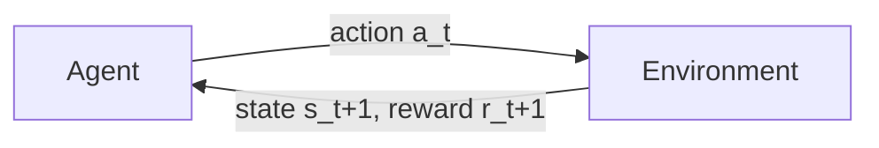
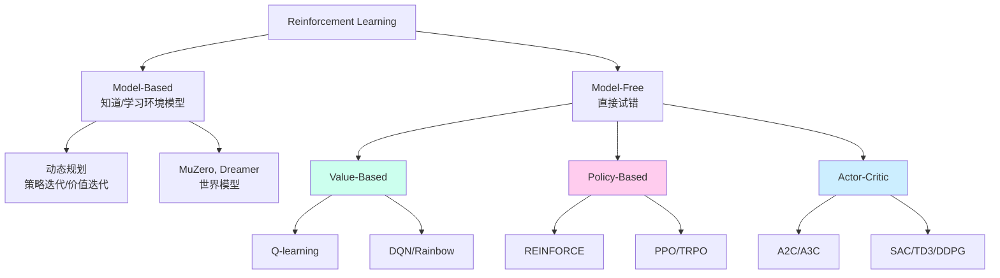

# 1. 什么是强化学习？

## 1.1 一句话定义

> **强化学习（RL）= 一个智能体（Agent）通过与环境（Environment）交互，从奖励（Reward）信号中学到一个策略（Policy），使得长期累积奖励最大化。**



这就是 RL 的全部 —— 一个闭环。所有花哨的算法（DQN、PPO、SAC……）都在解决同一个问题：**怎么让这个闭环更高效地学到好策略**。

---

## 1.2 与监督/无监督学习的区别

| 维度 | 监督学习 SL | 无监督学习 UL | 强化学习 RL |
|-----|------------|--------------|-----------|
| 数据 | (x, y) 对 | x 集合 | (s, a, r, s') 序列 |
| 反馈 | 标签直接 | 无 | **延迟、稀疏、有噪声** |
| 目标 | 最小化预测误差 | 找结构 | **最大化长期回报** |
| 数据分布 | i.i.d. | i.i.d. | **由策略决定，非 i.i.d.** |

**RL 难在哪？**
1. **延迟奖励**：你下棋走第 1 步，要赢/输了才知道好不好
2. **探索 vs 利用**：你不知道有没有更好的策略
3. **非平稳分布**：策略一改，状态分布全变了
4. **样本效率低**：动辄百万步的训练

---

## 1.3 RL 的关键术语

| 术语 | 符号 | 说明 |
|------|-----|------|
| State | $s$ | 环境的描述（GPS+IMU 读数、地图栅格…） |
| Action | $a$ | 智能体能做的事（修正量、选哪条路…） |
| Reward | $r$ | 环境的即时反馈（与真值距离的负数…） |
| Policy | $\pi(a\|s)$ | 在状态 s 下选动作 a 的概率分布 |
| Trajectory | $\tau = (s_0,a_0,r_0,s_1,a_1,\ldots)$ | 一条交互序列 |
| Return | $G_t = \sum_{k=0}^\infty \gamma^k r_{t+k}$ | 从 t 时刻起的折扣累积奖励 |
| Value | $V^\pi(s) = \mathbb{E}_\pi[G_t\|s_t=s]$ | 状态价值 |
| Q-Value | $Q^\pi(s,a) = \mathbb{E}_\pi[G_t\|s_t=s,a_t=a]$ | 动作价值 |
| Discount | $\gamma \in [0,1)$ | 未来奖励的折扣率 |

---

## 1.4 RL 的算法谱系图



---

## 1.5 RL 的典型应用领域

| 领域 | 例子 |
|-----|------|
| 游戏 AI | AlphaGo、AlphaStar、OpenAI Five |
| 机器人控制 | 机械臂抓取、四足/双足行走 |
| 自动驾驶 | 决策规划、行为预测 |
| 推荐系统 | 在线广告/内容排序（contextual bandit） |
| 大语言模型对齐 | RLHF / DPO / GRPO |
| 系统优化 | 数据中心冷却、芯片设计 |
| **定位与导航** | GNSS 修正、地图匹配、路径规划（详见第 6 章） |

---

## 1.6 一个最小例子：随机策略玩 CartPole

```python
import gymnasium as gym

env = gym.make("CartPole-v1")
obs, _ = env.reset(seed=0)
total = 0
for _ in range(500):
    action = env.action_space.sample()       
    obs, r, term, trunc, _ = env.step(action)
    total += r
    if term or trunc:
        print("episode return:", total); break
```

随机策略平均能撑 ~20 步。学完本章后，你将用 Q-learning 把这个数字推到 **200**。

---

## 进一步阅读

- Sutton & Barto Ch.1
- David Silver Lecture 1
- [OpenAI Spinning Up: Part 1](https://spinningup.openai.com/en/latest/spinningup/rl_intro.html)

## 思考题

- 解释 "exploration vs exploitation"，举一个生活中的例子
- 为什么 RL 不能直接套用 SL 的思路？
- on-policy 和 off-policy 的本质区别
