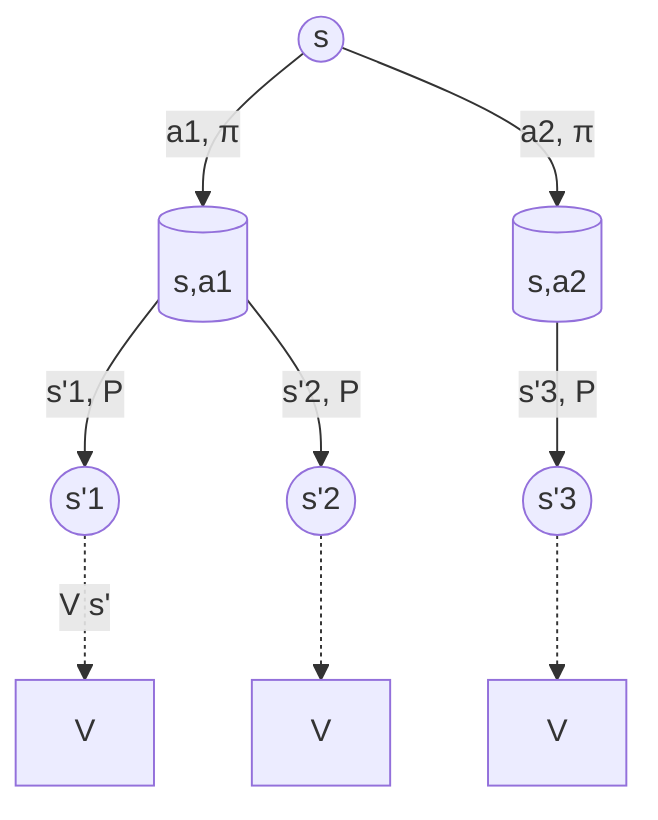

# 3. 贝尔曼方程：RL 的牛顿第二定律

> 如果只能选一个公式作为 RL 的标志，那一定是 Bellman 方程。

## 3.1 直觉：递归地定义价值

价值函数 $V^\pi(s)$ 的定义是「未来回报的期望」。但未来回报是无穷项求和，怎么算？

**关键洞察**：未来回报 = 下一步 reward + 折扣后的「下一步开始的未来回报」

$$
V^\pi(s) = \mathbb{E}_\pi\left[r_{t+1} + \gamma V^\pi(s_{t+1}) \mid s_t = s\right]
$$

这就是 **Bellman 期望方程**。

---

## 3.2 完整推导

$$
\begin{aligned}
V^\pi(s) &= \mathbb{E}_\pi[G_t \mid s_t=s] \\
         &= \mathbb{E}_\pi[r_{t+1} + \gamma G_{t+1} \mid s_t=s] \\
         &= \mathbb{E}_\pi[r_{t+1} \mid s_t=s] + \gamma \mathbb{E}_\pi[G_{t+1} \mid s_t=s] \\
         &= \sum_a \pi(a|s) \sum_{s'} P(s'|s,a)\Big[R(s,a,s') + \gamma V^\pi(s')\Big]
\end{aligned}
$$

类似地，对 Q 函数：

$$
Q^\pi(s,a) = \sum_{s'} P(s'|s,a)\Big[R(s,a,s') + \gamma \sum_{a'} \pi(a'|s') Q^\pi(s', a')\Big]
$$

---

## 3.3 Bellman 最优方程

**最优策略** $\pi^*$ 对应的最优价值：

$$
V^*(s) = \max_a \sum_{s'} P(s'|s,a)\Big[R(s,a,s') + \gamma V^*(s')\Big]
$$

$$
\boxed{Q^*(s,a) = \sum_{s'} P(s'|s,a)\Big[R(s,a,s') + \gamma \max_{a'} Q^*(s', a')\Big]}
$$

最后这个就是 **Q-learning 的目标**。

---

## 3.4 Backup 图直观

**期望方程**：在 s 节点对 a 取期望（按 π），在 (s,a) 节点对 s' 取期望（按 P）
**最优方程**：在 s 节点取 max，在 (s,a) 节点对 s' 取期望

---

## 3.5 Bellman 算子与不动点

定义 **Bellman 最优算子** $T^*$：

$$
(T^* V)(s) = \max_a \sum_{s'} P(s'|s,a)[R + \gamma V(s')]
$$

性质（**关键定理**）：

1. $T^*$ 是 $\gamma$-收缩映射（contraction）：$\|T^* V_1 - T^* V_2\|_\infty \leq \gamma \|V_1 - V_2\|_\infty$
2. 由 Banach 不动点定理，$T^*$ 有唯一不动点 $V^*$
3. **价值迭代** $V_{k+1} = T^* V_k$ 必然收敛到 $V^*$

> 💡 这就是为什么价值迭代/Q-learning **理论上保证收敛**（在表格情况下）。

---

## 3.6 一个 2 状态例子手算

环境：
- 状态：{A, B}
- 动作：只有一个 "stay"
- 转移：A→B 概率 1，B→A 概率 1
- 奖励：A→B 得 1，B→A 得 0
- $\gamma = 0.9$

求 $V^\pi(A), V^\pi(B)$。

由 Bellman：

$$
V(A) = 1 + 0.9 \cdot V(B)
$$
$$
V(B) = 0 + 0.9 \cdot V(A)
$$

代入：$V(A) = 1 + 0.9 \cdot 0.9 \cdot V(A) \Rightarrow V(A) = \frac{1}{1 - 0.81} \approx 5.26$

$V(B) = 0.9 \times 5.26 \approx 4.74$

---

## 3.7 直观应用举例

例如在 GNSS 修正问题里，Bellman 方程告诉我们：**当前修正动作的价值 = 即时定位精度提升 + 未来定位精度提升的折扣和**。

这意味着 RL 不会只贪心地最大化当前精度，还会考虑「这次修正会不会让下一时刻的定位更难/更容易」。这是它优于纯贪心修正的关键原因。

---

## 进一步阅读

- Sutton & Barto Ch.3.5-3.6
- Bertsekas《Dynamic Programming and Optimal Control》Vol 1 Ch.1

## 思考题

- 写出 Bellman 最优方程
- 为什么价值迭代收敛？（提示：Bellman 算子是收缩映射）
- 解释 V 和 Q 之间的关系
