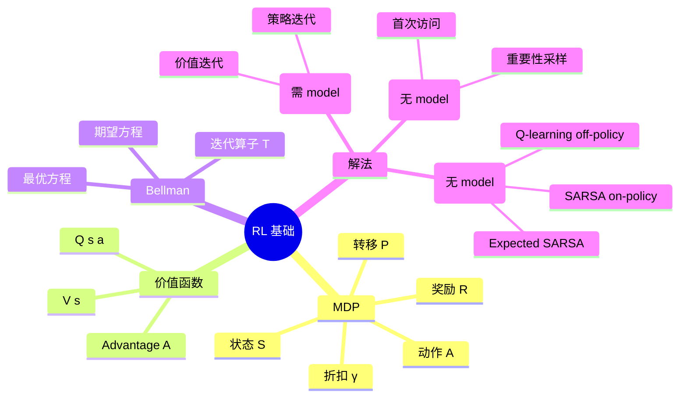

# 01 RL 基础理论

> **本章目标**：掌握所有现代 RL 算法的理论基石。学完后你应该能在白板上推 Bellman 方程、能手写一个 Q-learning。

## 目录

| 文件 | 主题 | 形式 |
|-----|------|------|
| [01_intro_to_rl.md](./01_intro_to_rl.md) | RL 是什么、与 SL/UL 的区别、典型场景 | md |
| [02_mdp.md](./02_mdp.md) | 马尔可夫决策过程、状态/动作/奖励/策略 | md |
| [03_bellman_equation.md](./03_bellman_equation.md) | 贝尔曼期望/最优方程、推导与几何直觉 | md |
| [04_dynamic_programming.ipynb](./04_dynamic_programming.ipynb) | 策略迭代/价值迭代 + GridWorld 实现 | jupyter |
| [05_monte_carlo.ipynb](./05_monte_carlo.ipynb) | MC 预测与控制、首次/每次访问 | jupyter |
| [06_temporal_difference.ipynb](./06_temporal_difference.ipynb) | TD(0)、SARSA、Q-learning 三件套 | jupyter |

## 核心概念地图

## 学习建议

1. 先读 `01-03` md（约 2 小时），把数学符号和概念建立起来
2. 再跑 `04-06` 三个 notebook（约 4 小时），**亲手实现** GridWorld
3. 完成后做下面自检

## 自检题（建议手写答案）

1. 用一句话说明 model-based 和 model-free 的本质区别。
2. 为什么折扣因子 γ 通常取 0.95-0.99？取 0 会怎样？取 1 会怎样？
3. 推导 Bellman 期望方程从 V 到 V 的递归形式。
4. SARSA 和 Q-learning 的 update target 有什么区别？哪个更激进？
5. 如果 GPS 定位问题里的「奖励」该怎么设计？（开放题）

## 推荐阅读

- Sutton & Barto Ch.3-6
- 张伟楠《动手学强化学习》第 3-5 章
- David Silver Lecture 2-4
