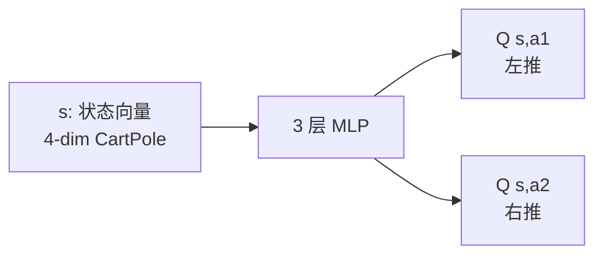

# 1. Deep Q-Network (DQN)

> 2013 年 DeepMind 用一个网络通杀 49 款 Atari 游戏，开启了深度强化学习（Deep RL）时代。

## 1.1 从 Q 表到 Q 网络

表格 Q-learning：$Q(s, a) \in \mathbb{R}^{|S| \times |A|}$ —— 状态多了就装不下。

**DQN 思想**：用神经网络 $Q_\theta(s, a)$ 近似 Q 函数。

输入状态 $s$，输出每个动作的 Q 值（**注意输出维度 = 动作数**）：



## 1.2 朴素 DL + Q-learning 为什么失败？

最直接的想法是：

$$L(\theta) = \left(Q_\theta(s,a) - \big(r + \gamma \max_{a'} Q_\theta(s',a')\big)\right)^2$$

但**直接训练会发散**，原因有 3：

| 问题 | 后果 | 解法 |
|-----|------|------|
| 样本强相关（连续 step） | 违反 i.i.d. 假设 | **Replay Buffer** |
| target 也用 $Q_\theta$（移动靶） | 训练不稳定 | **Target Network** $Q_{\theta^-}$ |
| 高估偏差（max 操作） | 价值估计漂高 | **Double DQN** |

## 1.3 DQN 三大件

### ① Replay Buffer

存储 transition $(s, a, r, s', \text{done})$ 到一个固定大小的循环队列里。每次训练随机采样 batch，**打散时序相关性**。

```python
from collections import deque
import random

class ReplayBuffer:
    def __init__(self, capacity=100_000):
        self.buf = deque(maxlen=capacity)
    def push(self, *transition):
        self.buf.append(transition)
    def sample(self, batch_size):
        return random.sample(self.buf, batch_size)
    def __len__(self):
        return len(self.buf)
```

### ② Target Network

复制一份 $Q_\theta$ 参数得到 $Q_{\theta^-}$，**只用它算 TD target**，每隔 N 步同步一次：

$$y = r + \gamma \max_{a'} Q_{\theta^-}(s', a')$$

```python
target_net.load_state_dict(online_net.state_dict())   
```

或软更新（DDPG/SAC 常用）：

```python
for tp, p in zip(target_net.parameters(), online_net.parameters()):
    tp.data.copy_(tau * p.data + (1 - tau) * tp.data)
```

### ③ ε-greedy 探索

```python
if random.random() < epsilon:
    action = env.action_space.sample()
else:
    action = q_net(state).argmax(-1).item()
```

ε 通常从 1.0 线性衰减到 0.05。

## 1.4 完整算法（伪代码）

```
初始化 Q_θ, Q_θ⁻ ← Q_θ, replay buffer D
for episode = 1, M:
    s ← env.reset()
    for t = 1, T:
        a ← ε-greedy(Q_θ, s)
        s', r, done ← env.step(a)
        D.push(s, a, r, s', done)
        if len(D) > batch_size:
            采样 batch (s_i, a_i, r_i, s'_i, done_i)
            y_i = r_i + γ * (1-done_i) * max_a' Q_θ⁻(s'_i, a')
            loss = mean((Q_θ(s_i, a_i) - y_i)^2)
            θ ← θ - α ∇loss
        每 C 步：Q_θ⁻ ← Q_θ
        s ← s'
        if done: break
```

## 1.5 易踩坑

| 坑 | 现象 | 解决 |
|----|-----|-----|
| 忘记 detach target | loss 一直降但 Q 爆炸 | `with torch.no_grad():` 算 target |
| done 时还加 next Q | 终止状态被错误高估 | `(1 - done)` 屏蔽 |
| 学习率太大 | Q 值 NaN | lr=1e-4 起步，配合 grad clip |
| Buffer 太小 | 样本相关性大 | 至少 10⁵ |
| 训练初期就更新 | warmup 不足 | 等 buffer 填到 batch_size 再 train |

## 1.6 一个具象应用例子：卫星选择

**问题**：在 GNSS 接收机有 N 颗可见卫星时，**选哪些卫星组合**用于定位计算。

| MDP 元素 | 设计 |
|---------|------|
| State | 各卫星的 SNR、仰角、方位角、伪距残差，共 N×4 维 |
| Action | 离散：选「全部」「前 5 颗 SNR 最高」「剔除最差 2 颗」等 K 种策略 |
| Reward | $-\|\hat{p} - p_{\text{truth}}\|$ |

→ 这是典型的离散动作问题，**DQN 完美适用**。

## 进一步阅读

- [Mnih et al. 2013, "Playing Atari with Deep Reinforcement Learning"](https://arxiv.org/abs/1312.5602)
- [Mnih et al. 2015, "Human-level control through deep RL" (Nature)](https://www.nature.com/articles/nature14236)
- [CleanRL DQN 实现（单文件，强烈推荐读）](https://github.com/vwxyzjn/cleanrl/blob/master/cleanrl/dqn.py)

## 思考题

- 为什么需要 target network？
- DQN 为什么用 replay buffer，而 PPO 不需要？
- DQN 能处理连续动作吗？为什么？怎么解决？
