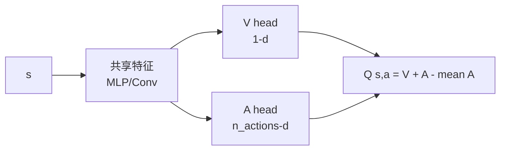

# 4. Dueling DQN：分离状态价值与优势

## 4.1 动机

很多状态下，动作选哪个差不多（如赛车直道）。如果直接学 Q(s,a)，网络要为每个动作单独学，浪费容量。

**关键洞察**：$Q(s,a) = V(s) + A(s,a)$
- $V(s)$ 反映"这个状态本身好不好"
- $A(s,a)$ 反映"在此状态下选 a 比选其他动作好多少"

## 4.2 网络架构



## 4.3 关键技巧：去除恒等性

如果直接 $Q = V + A$，网络可以把 $V$ 和 $A$ 各自加减一个常数还能等价 → 训练不稳定。

**修正**：减去 mean（或 max）

$$Q(s,a) = V(s) + \left(A(s,a) - \frac{1}{|\mathcal{A}|} \sum_{a'} A(s, a')\right)$$

```python
class DuelingQNet(nn.Module):
    def __init__(self, obs_dim, n_actions):
        super().__init__()
        self.shared = nn.Sequential(nn.Linear(obs_dim, 128), nn.ReLU(),
                                    nn.Linear(128, 128), nn.ReLU())
        self.v_head = nn.Linear(128, 1)
        self.a_head = nn.Linear(128, n_actions)

    def forward(self, x):
        h = self.shared(x)
        v = self.v_head(h)                 # (B, 1)
        a = self.a_head(h)                 # (B, n_actions)
        return v + (a - a.mean(dim=1, keepdim=True))
```

## 4.4 何时受益最大？

- 动作多（10+）
- 大部分状态下动作影响很小

## 进一步阅读

- Wang et al. 2016, ["Dueling Network Architectures for Deep RL"](https://arxiv.org/abs/1511.06581)
