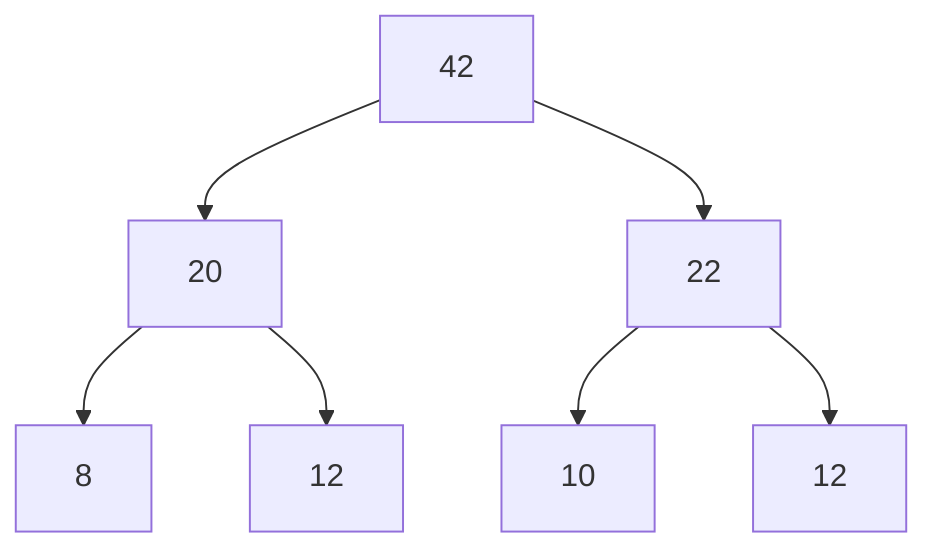

# 5. Prioritized Experience Replay (PER)

## 5.1 动机

均匀采样浪费 —— 大部分 transition 没什么信息量。

**核心想法**：**TD error 大的 transition 信息量大，应多采样**。

$$p_i \propto |\delta_i|^\alpha + \epsilon$$

- $\alpha=0$ 退化为均匀采样
- $\alpha=1$ 完全按 TD error 比例

## 5.2 偏差修正：Importance Sampling Weights

非均匀采样会引入偏差（破坏期望无偏性），需要 IS 权重补偿：

$$w_i = \left(\frac{1}{N \cdot p_i}\right)^\beta$$

$\beta$ 从 0.4 线性增到 1.0（训练初期容忍偏差，后期严格修正）。

## 5.3 数据结构：SumTree

为高效采样和更新优先级，用 **sum tree**（完全二叉树）：
- 叶子存优先级 $p_i$
- 内部节点存子树和
- 采样：在 $[0, \text{root}]$ 均匀采一个数 $r$，沿树下行 → $O(\log N)$
- 更新：从叶子向根回溯 → $O(\log N)$

## 5.4 与定位场景

GNSS 训练数据中，**城市峡谷场景**（NLOS 多）远比开阔场景稀少 —— 用 PER 让稀有但重要的样本被多次学习。

## 进一步阅读

- Schaul et al. 2016, ["Prioritized Experience Replay"](https://arxiv.org/abs/1511.05952)
- 实现参考：[stable-baselines3-contrib QR-DQN with PER](https://github.com/Stable-Baselines-Team/stable-baselines3-contrib)
