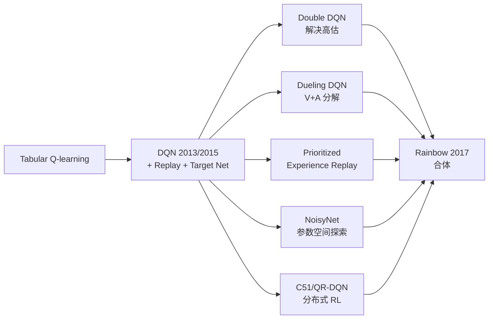

# 02 价值函数方法（DQN 全家桶）

> **本章目标**：从表格 Q-learning 进入深度 Q 学习时代，掌握 DQN 及其改进。

## 文件列表

| 文件 | 主题 |
|-----|-----|
| [01_dqn.md](./01_dqn.md) | DQN 原理（Replay Buffer / Target Network / 训练流程） |
| [02_dqn_cartpole.ipynb](./02_dqn_cartpole.ipynb) | 从零实现 DQN 解 CartPole |
| [03_double_dqn.md](./03_double_dqn.md) | Double DQN：解决高估偏差 |
| [04_dueling_dqn.md](./04_dueling_dqn.md) | Dueling 架构：分离 V 和 A |
| [05_per.md](./05_per.md) | 优先经验回放 |
| [06_rainbow.md](./06_rainbow.md) | Rainbow：6 大改进合体 |

## 算法谱系

## 价值方法的核心局限

1. 只适用 **离散** 动作空间（连续动作请用 DDPG/SAC）
2. 高估偏差（→ Double DQN）
3. 样本相关性强（→ Replay Buffer）
4. 自举不稳定（→ Target Network）

> 价值方法适合「从一组候选项中做选择」这种离散决策问题，例如游戏动作选择、路段/传感器组合选择等。
