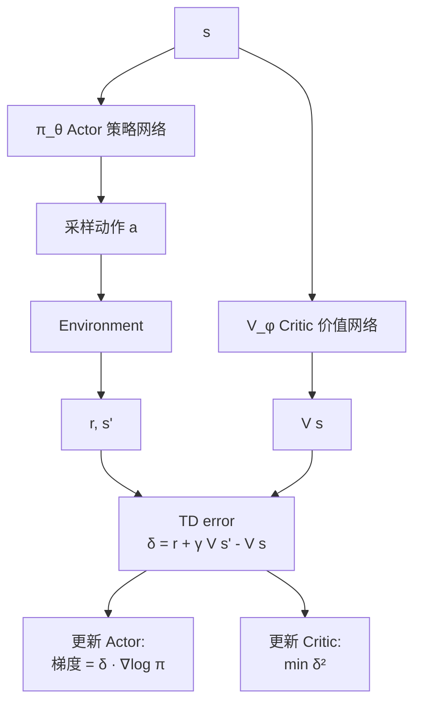

# 2. Actor-Critic 方法

## 2.1 思路

REINFORCE 方差太大。把 $G_t$ 替换成 advantage $A_t = Q(s_t, a_t) - V(s_t)$，方差小很多。

但 $V, Q$ 也是未知的 → **再训一个网络估计它**！



## 2.2 A2C 损失函数

$$L_{actor} = -\sum_t \log \pi_\theta(a_t|s_t) \cdot \hat{A}_t$$

$$L_{critic} = \sum_t (V_\phi(s_t) - R_t)^2$$

通常加一个**熵正则**鼓励探索：

$$L = L_{actor} + c_1 L_{critic} - c_2 H[\pi(\cdot|s_t)]$$

## 2.3 Advantage 的几种估计

| 方法 | 公式 | 偏差 | 方差 |
|-----|------|-----|-----|
| MC | $G_t - V(s_t)$ | 低 | 高 |
| 1-step TD | $r_t + \gamma V(s_{t+1}) - V(s_t)$ | 高 | 低 |
| n-step | $\sum_{k=0}^{n-1} \gamma^k r_{t+k} + \gamma^n V(s_{t+n}) - V(s_t)$ | 中 | 中 |
| **GAE(λ)** | $\sum_l (\gamma\lambda)^l \delta_{t+l}$ | 可调 | 可调 |

GAE 是 n-step 的指数加权平均，PPO 默认用，**$\lambda=0.95$**。

## 2.4 A3C 与 A2C

- **A3C**（Asynchronous）：多个 worker 并行采样，异步更新全局参数
- **A2C**（Synchronous）：所有 worker 等同步后再更新一次（实际更稳）

## 2.5 简单 A2C 实现框架

```python
class ActorCritic(nn.Module):
    def __init__(self, obs_dim, n_actions):
        super().__init__()
        self.shared = nn.Sequential(nn.Linear(obs_dim, 128), nn.ReLU())
        self.actor = nn.Linear(128, n_actions)
        self.critic = nn.Linear(128, 1)
    def forward(self, x):
        h = self.shared(x)
        return self.actor(h), self.critic(h)
```

## 进一步阅读

- Mnih et al. 2016, ["Asynchronous Methods for Deep RL" (A3C)](https://arxiv.org/abs/1602.01783)
- Schulman et al. 2015, ["High-Dimensional Continuous Control Using Generalized Advantage Estimation"](https://arxiv.org/abs/1506.02438)
