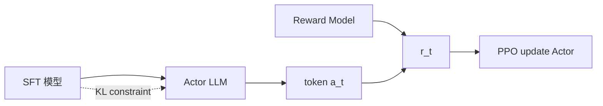

# 3. PPO (Proximal Policy Optimization)

> 当前工业界最常用的 RL 算法。OpenAI Five、ChatGPT RLHF、绝大多数机器人项目都用它。

## 3.1 动机：策略更新别太大

普通策略梯度更新一步可能让新策略和旧策略差太远 → 性能崩溃 → 难以恢复（**RL 的特点：训坏一次就回不去了**）。

**TRPO**（PPO 的前身）用 KL 约束限制 $\pi_{\text{new}}, \pi_{\text{old}}$ 的距离，但实现复杂（要解二阶优化）。

**PPO 的简化**：用 clip 函数粗暴地限制更新幅度，效果几乎一样好。

## 3.2 PPO-Clip 损失（核心公式）

定义重要性采样比：

$$r_t(\theta) = \frac{\pi_\theta(a_t|s_t)}{\pi_{\theta_{old}}(a_t|s_t)}$$

PPO-Clip 目标：

$$L^{CLIP}(\theta) = \mathbb{E}_t\Big[\min\big(r_t(\theta) \hat{A}_t,\ \text{clip}(r_t(\theta), 1-\epsilon, 1+\epsilon) \hat{A}_t\big)\Big]$$

通常 $\epsilon = 0.2$。

**直觉**：
- 当 $\hat{A}_t > 0$（这个动作好），允许 $r_t$ 增大，但最多到 $1+\epsilon$
- 当 $\hat{A}_t < 0$（这个动作差），允许 $r_t$ 减小，但最多到 $1-\epsilon$
- min 操作保证我们取**保守的那一边**（悲观估计）

```
A > 0:
                     │
              ┌──────┘ <- 截断在 1+ε
              │
   ───────────┘ ───────────> r_t
            1-ε  1  1+ε

A < 0:
   ───────────┐
              │
              └──────┐ <- 截断在 1-ε
                     │
   ───────────────────────> r_t
            1-ε  1  1+ε
```

## 3.3 完整算法

```
for iteration = 1, ...:
    用 π_θ_old 采集 N 步数据 (s, a, r, s')
    用 GAE 计算 A_t, V_target_t
    for epoch = 1, K:                # 通常 K=4~10
        for minibatch in 数据:
            r_t = π_θ(a|s) / π_θ_old(a|s)
            L_clip = -min(r_t · A_t, clip(r_t, 1-ε, 1+ε) · A_t)
            L_value = (V_φ(s) - V_target)²
            L_entropy = -H[π_θ(·|s)]
            loss = L_clip + 0.5 * L_value + 0.01 * L_entropy
            梯度更新 (θ, φ)
    π_θ_old ← π_θ
```

## 3.4 关键超参（默认值)

| 超参 | 推荐值 | 说明 |
|-----|-------|-----|
| `clip ε` | 0.2 | clip 范围 |
| `gamma` | 0.99 | 折扣 |
| `lambda` (GAE) | 0.95 | GAE 衰减 |
| `n_steps` | 2048 | 单次采样步数 |
| `n_epochs` | 10 | 每批数据 epoch 数 |
| `batch_size` | 64 | minibatch |
| `lr` | 3e-4 | Adam |
| `value_coef` | 0.5 | critic loss 权重 |
| `entropy_coef` | 0.01 | 探索鼓励 |
| `clip_grad` | 0.5 | 梯度裁剪 |

## 3.5 PPO 为什么应用如此广泛

1. **稳定**：clip 让训练不容易崩
2. **简单**：没有二阶优化、没有 replay buffer 的复杂管理
3. **通用**：离散/连续动作都支持
4. **可并行**：天然适合多个 env 并行采样
5. **超参鲁棒**：默认值在大多数任务上都能 work

## 3.6 PPO 在 RLHF 中的角色



ChatGPT/Claude 等 LLM 训练第三阶段就是 PPO（最近也有 DPO/GRPO 等替代方案）。

## 3.7 易踩坑

| 坑 | 症状 | 解决 |
|----|-----|-----|
| 没标准化 advantage | 学不动 | `(A - A.mean()) / (A.std() + 1e-8)` |
| value loss 主导 | actor 不更新 | 调小 value_coef，或归一化 reward |
| n_epochs 太大 | 旧策略偏离严重 | 减到 4-10 |
| 没用 GAE | 方差大 | 改用 GAE(λ=0.95) |
| 连续动作 std 学崩 | 探索消失 | 用 state-independent log_std 或加下限 |

## 进一步阅读

- Schulman et al. 2017, ["Proximal Policy Optimization Algorithms"](https://arxiv.org/abs/1707.06347)
- [37 Implementation Details of PPO](https://iclr-blog-track.github.io/2022/03/25/ppo-implementation-details/) ← **强烈推荐**

## 思考题

- PPO 与 TRPO 区别
- 为什么用 clip 而不是 KL penalty？
- 解释 importance sampling ratio 的作用
- PPO 是 on-policy 还是 off-policy？为什么能多 epoch？
