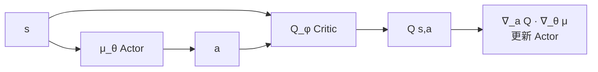

# 5. DDPG / TD3：连续动作的 off-policy 方法

## 5.1 DDPG (Deep Deterministic Policy Gradient)

DQN 不能处理连续动作（max 难以解析求）。DDPG 把 actor 设成**确定性策略** $\mu_\theta(s)$，然后用 critic Q(s, μ(s)) 来梯度上升。

**关键损失**：

$$L_{critic} = \mathbb{E}\left[\Big(Q_\phi(s,a) - (r + \gamma Q_{\phi^-}(s', \mu_{\theta^-}(s')))\Big)^2\right]$$

$$L_{actor} = -\mathbb{E}_s[Q_\phi(s, \mu_\theta(s))]$$

**特性**：
- off-policy（有 replay buffer）
- 探索：动作上加 OU 噪声（或高斯噪声）
- target network 用软更新 $\tau \approx 0.005$

## 5.2 DDPG 的痛点

- 高估偏差严重（同 DQN）
- 对超参极度敏感
- Critic 训得太好但策略学不到

## 5.3 TD3 (Twin Delayed DDPG)

3 大改进：

1. **Clipped Double Q-learning**：用两个 Critic，target 取 min
   $$y = r + \gamma \min_{i=1,2} Q_{\phi_i^-}(s', \tilde{a})$$
2. **Delayed Policy Updates**：actor 更新频率比 critic 慢（通常 1:2）
3. **Target Policy Smoothing**：target action 加噪声防过拟合
   $$\tilde{a} = \mu_{\theta^-}(s') + \text{clip}(\epsilon, -c, c),\ \epsilon \sim \mathcal{N}$$

TD3 在多数连续控制 benchmark 上稳定击败 DDPG。

## 5.4 何时用 DDPG/TD3 vs SAC？

- **DDPG**：基本不再用了
- **TD3**：确定性策略需求、SAC 调不通时
- **SAC**：默认首选，下一节详述

## 进一步阅读

- DDPG: Lillicrap et al. 2015, ["Continuous control with DRL"](https://arxiv.org/abs/1509.02971)
- TD3: Fujimoto et al. 2018, ["Addressing Function Approximation Error in Actor-Critic"](https://arxiv.org/abs/1802.09477)
