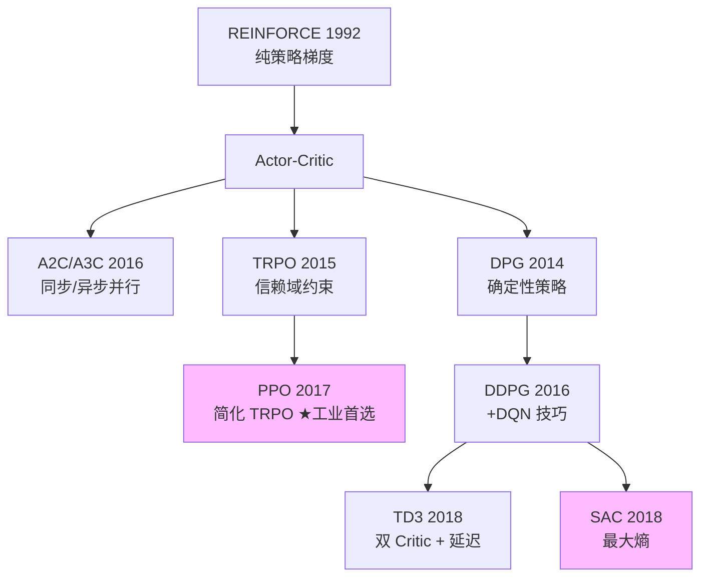

# 03 策略梯度方法

> **本章目标**：从 REINFORCE 到 PPO/SAC，掌握**直接优化策略**的方法。这是 LLM RLHF/PPO 训练、连续控制、机器人、自动驾驶领域的主流。

## 文件列表

| 文件 | 主题 |
|-----|-----|
| [01_policy_gradient.md](./01_policy_gradient.md) | REINFORCE 与策略梯度定理 |
| [02_actor_critic.md](./02_actor_critic.md) | A2C/A3C：用 Critic 减小方差 |
| [03_ppo.md](./03_ppo.md) | PPO：当前工业界最常用的算法 |
| [04_ppo_cartpole.ipynb](./04_ppo_cartpole.ipynb) | PPO 从零实现 |
| [05_ddpg_td3.md](./05_ddpg_td3.md) | DDPG/TD3：连续动作的 off-policy |
| [06_sac.md](./06_sac.md) | SAC：最大熵 RL |

## 价值 vs 策略

| | 价值方法 (DQN) | 策略方法 (PPO/SAC) |
|--|--------------|------------------|
| 学什么 | Q(s,a) 然后 argmax | 直接学 π(a\|s) |
| 动作类型 | 离散 | 离散 ✅ + 连续 ✅ |
| on/off-policy | off-policy | 多数 on-policy（SAC 是 off） |
| 探索 | ε-greedy | 策略本身随机 |
| 样本效率 | 高（buffer 复用） | 低（PPO）/ 高（SAC） |
| 稳定性 | 中 | 高（PPO） |

## 算法谱系

## 工业选型经验

| 场景 | 推荐 |
|-----|------|
| 离散动作、稳定性优先 | **PPO** |
| 连续动作、机器人 | **SAC** |
| LLM 微调（RLHF） | **PPO / GRPO** |
| 极致样本效率 | **SAC** / Model-based |
| 大规模并行训练 | **PPO + IMPALA** |

## 自检

- [ ] 推导策略梯度定理
- [ ] 解释为什么 PPO 用 clip 而不是 KL penalty
- [ ] 说明 SAC 为什么需要熵正则
