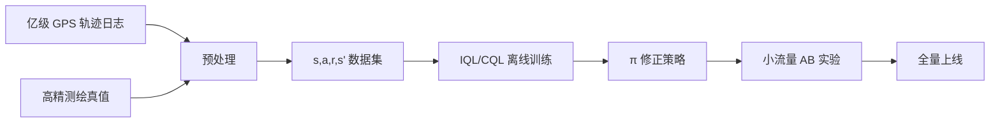

# 2. Offline RL（批处理强化学习）

> **核心问题**：能不能只用一个**固定的、预先收集的数据集**学到好策略，不再与环境交互？
> **核心难点**：分布外（OOD）动作的 Q 值估计高估到天上去 → 策略走向"幻觉"动作。

## 2.1 为什么离线 RL 难？

回顾 Q-learning 更新：

$$Q(s,a) \leftarrow Q(s,a) + \alpha[r + \gamma \max_{a'} Q(s', a') - Q(s,a)]$$

`max_{a'}` 操作可能选到**数据集里从未出现过的 a'**，这时 Q(s', a') 是网络瞎猜的 → 越学越离谱（外推误差 extrapolation error）。

```
数据集动作分布 |■■■■|
被 max 选到的 a' |          ■  <- OOD!
         网络对 OOD 的 Q 估计：很高（错觉）
```

## 2.2 三大主流离线算法

### ① CQL (Conservative Q-Learning)

**思路**：人为压低 OOD 动作的 Q 值。

$$L_{CQL} = \alpha \mathbb{E}_{s \sim \mathcal{D}}\Big[\log \sum_a \exp Q(s,a) - \mathbb{E}_{a \sim \pi_\beta}[Q(s,a)]\Big] + L_{TD}$$

第一项压低所有动作的 Q（特别是 OOD 的），第二项保留数据集里见过的动作的 Q。

### ② IQL (Implicit Q-Learning)

**思路**：根本不算 max，用 expectile regression（分位数回归）：

$$L_V = \mathbb{E}\big[L_2^\tau(Q(s,a) - V(s))\big]$$

其中 $L_2^\tau(u) = |\tau - \mathbb{1}(u<0)| u^2$。τ=0.7~0.9 时近似 max 但永远不会查询 OOD。

更新策略用 advantage-weighted regression：

$$L_\pi = -\mathbb{E}\big[\exp(\beta(Q(s,a) - V(s))) \cdot \log \pi(a|s)\big]$$

→ **IQL 实现简单 + 调参少 + 效果好，工业首推**。

### ③ Decision Transformer (DT)

**思路**：把 RL 当作序列建模问题。给定 (return-to-go, state, action) 序列，让 Transformer 预测下一个 action。

```
input:  R₁, s₁, a₁, R₂, s₂, a₂, R₃, s₃, ...
target:                              a₃
```

测试时，给一个目标 return $R^*$，模型自动生成达成它的动作序列。

→ 完全不需要 Bellman 更新，纯监督学习！

## 2.3 数据集

**D4RL** 是离线 RL 标准 benchmark：
```python
import d4rl, gym
env = gym.make('halfcheetah-medium-v2')
dataset = d4rl.qlearning_dataset(env)   
```

每个任务有 4 种数据质量：random / medium / medium-replay / expert / medium-expert。

## 2.4 与定位场景的对接

**典型工业 pipeline**：



**关键问题**：
- 怎么从轨迹日志构造 (s, a, r, s')？
  - 状态 s = 当前 GNSS+IMU+地图 context
  - 动作 a = "实际发生的修正量"（如果是规则修正系统的输出）
  - 奖励 r = 与高精真值的负距离
- 怎么避免 OOD？用 IQL；或先做 BC 当 baseline。
- 怎么评估？用 OPE (Off-Policy Evaluation) 方法估计离线策略的真实回报。

## 2.5 OPE：怎么离线评估一个策略好坏？

直接在数据集上评估很危险（同样有 OOD 问题）。常用方法：
- **Importance Sampling (IS)**：方差大
- **Doubly Robust (DR)**
- **Fitted Q Evaluation (FQE)**：再训一个 Q 网络专门评估目标策略
- **MAGIC** 等组合方法

## 进一步阅读

- Levine et al. 2020, ["Offline RL: Tutorial, Review, and Perspectives"](https://arxiv.org/abs/2005.01643) ★ 必读综述
- CQL: Kumar et al. 2020
- IQL: Kostrikov et al. 2021, ["Offline RL with Implicit Q-Learning"](https://arxiv.org/abs/2110.06169)
- Decision Transformer: Chen et al. 2021

## 思考题

- 为什么 off-policy 算法（如 SAC）直接用在离线数据上会失败？
- 解释 CQL 的核心思想
- 离线 RL 评估为什么难？有什么 OPE 方法？
