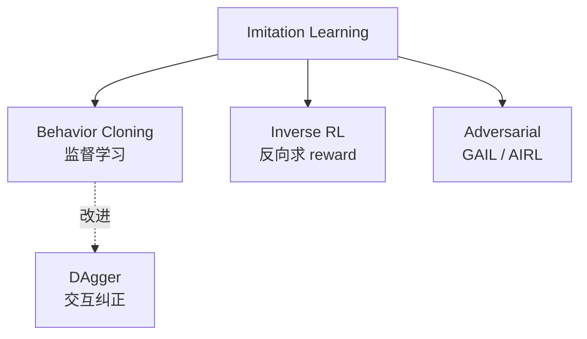
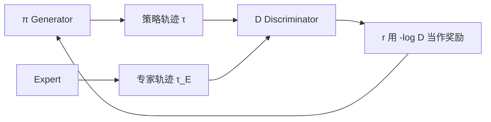

# 3. 模仿学习（Imitation Learning, IL）

> **核心思想**：不依赖 reward 信号，直接从专家演示学习。
> "专家"可以是人类操作记录、高精度传感器 / 真值数据、已有的规则系统输出等。在定位、自动驾驶、机器人等领域，这类示范数据通常都比较容易获取。

## 3.1 三大流派



## 3.2 Behavior Cloning (BC)

**最简单**：把 (s, a) 当 (x, y) 监督学习。

$$L_{BC}(\theta) = \mathbb{E}_{(s,a) \sim \mathcal{D}_{\text{expert}}}[-\log \pi_\theta(a|s)]$$

```python
class BCPolicy(nn.Module):
    def __init__(self, obs_dim, act_dim):
        super().__init__()
        self.net = nn.Sequential(nn.Linear(obs_dim, 128), nn.ReLU(),
                                 nn.Linear(128, 128), nn.ReLU(),
                                 nn.Linear(128, act_dim))
    def forward(self, x):
        return self.net(x)

policy = BCPolicy(obs_dim, act_dim)
optim = torch.optim.Adam(policy.parameters(), lr=1e-3)
for ep in range(100):
    for s, a in dataloader:
        loss = ((policy(s) - a) ** 2).mean()      
        optim.zero_grad(); loss.backward(); optim.step()
```

**致命问题**：**复合误差（covariate shift）**

```
专家轨迹  ●──●──●──●──●──●     (训练时 BC 看到的状态分布)
          
学到策略    ●─○──○──○      (推理时偏一点 → 进入没见过的状态 → 越偏越远)
```

## 3.3 DAgger（解决复合误差）

**Dataset Aggregation**：

```
D ← expert demonstrations
for i = 1, N:
    π_i ← train BC on D
    用 π_i rollout，遇到状态 s 时，问 expert "你会怎么做？" → a_expert
    D ← D ∪ {(s, a_expert)}
```

需要专家在线 query，工业里常用**预训练的高精模型**当专家。

## 3.4 GAIL（生成对抗模仿学习）

借用 GAN 思想：训练判别器 D 区分专家轨迹和学到策略的轨迹，同时训练生成器（策略）骗过判别器。



实际损失：
- D：$\max_D \mathbb{E}_{\tau_E}[\log D(s,a)] + \mathbb{E}_\tau[\log(1-D(s,a))]$
- π：用 PPO 优化，奖励 $r = -\log(1 - D(s,a))$ 或 $\log D$

## 3.5 IRL（反向强化学习）

不学策略，学 reward 函数。然后再用普通 RL 求最优策略。

应用：
- 当人类示范隐含某种意图，希望迁移到新环境
- 学习"舒适驾驶"风格

## 3.6 几类典型应用

| 场景 | 常用方案 |
|-----|---------|
| 用专家修正轨迹学一个 GPS / 定位修正策略 | **BC + DAgger** |
| 用真实驾驶轨迹学 ETA 模型 | BC（本质就是监督回归） |
| 学习"舒适驾驶 / 舒适路径规划"等带偏好的任务 | IRL → PPO |
| 用规则系统作专家训 RL | DAgger |
| 数据中专家与非专家混杂 | GAIL 或 Offline RL |

## 3.7 BC vs Offline RL vs Online RL

| 方法 | 数据要求 | 期望性能 | 难度 |
|-----|---------|---------|------|
| BC | 高质量专家演示 | ≤ 专家 | ⭐ |
| Offline RL (IQL) | 任意质量数据 | 可超过数据中最优 | ⭐⭐⭐ |
| Online RL (PPO) | 可在线交互 | 理论最优 | ⭐⭐⭐⭐ |

**经验法则**：
- 有专家数据且数据质量高 → BC 起步
- 数据混杂、质量参差 → Offline RL
- 有便宜可靠的 simulator → Online RL

## 进一步阅读

- Ross et al. 2011, ["A Reduction of Imitation Learning..." (DAgger)](https://arxiv.org/abs/1011.0686)
- Ho & Ermon 2016, ["Generative Adversarial Imitation Learning"](https://arxiv.org/abs/1606.03476)
- 综述：Hussein et al. 2017
