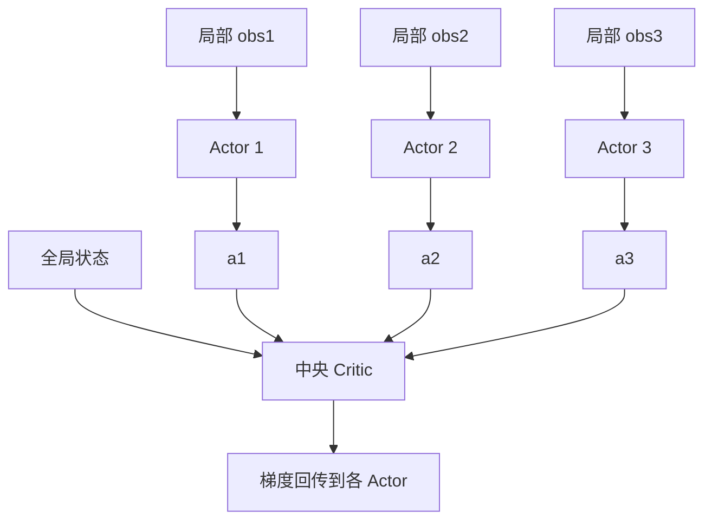

# 4. 多智能体强化学习（MARL）

## 4.1 设定

多个 agent 在同一环境中，每个 agent 有自己的策略 $\pi_i$，目标可以是：
- **完全合作**（所有 agent 共享 reward）→ 例：星际争霸 II 团战
- **完全竞争**（零和博弈）→ 例：围棋
- **混合**（部分合作部分竞争）→ 例：自动驾驶交通流

## 4.2 核心难点

1. **非平稳环境**：每个 agent 看其他 agent 的策略都在变
2. **维度灾难**：联合动作空间 $|A|^N$
3. **信用分配**：团队赢了，是谁的功劳？
4. **部分观测**：通常只看局部观测

## 4.3 经典范式：CTDE

**Centralized Training, Decentralized Execution**：训练时用全局信息（联合 critic），执行时只用局部观测。

## 4.4 主流算法

| 算法 | 思路 | 适用 |
|-----|-----|-----|
| **VDN** | $Q_{tot} = \sum Q_i$（值分解） | 合作 |
| **QMIX** | $Q_{tot} = f(Q_1, ..., Q_N)$，f 单调 | 合作 |
| **MADDPG** | 每个 agent 有自己的 actor，集中 critic | 混合 |
| **MAPPO** | PPO 的 MARL 版本 | 通用，强 baseline |
| **COMA** | 反事实 baseline 做信用分配 | 合作 |

## 4.5 与地图业务的弱相关性

地图业务里 agent 数量较少，更多是单 agent 视角。但有一些场景潜在适用：
- 智慧交通信号灯协同（路口 = agent）
- 多车队协同路径规划
- 多源 POI 推荐 agent

## 进一步阅读

- 综述：Zhang et al. 2019, ["Multi-Agent RL: A Selective Overview"](https://arxiv.org/abs/1911.10635)
- MAPPO: Yu et al. 2021
- PettingZoo（MARL 版 Gymnasium）：https://pettingzoo.farama.org/
