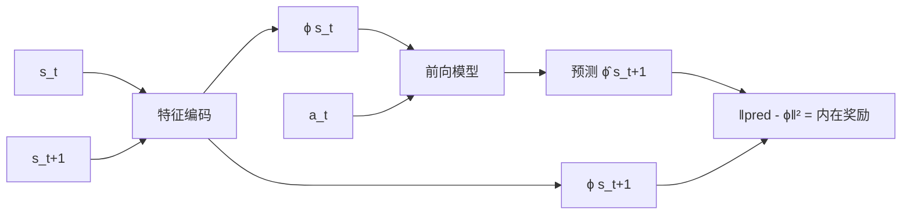

# 6. 探索策略（Exploration）

## 6.1 为什么探索是 RL 的核心难题？

ε-greedy 在简单问题上够用，但在**奖励稀疏**（如 Montezuma's Revenge）的环境里会卡死：智能体随机走永远拿不到第一个奖励。

## 6.2 主流探索范式

### A. Count-based
- 给"很少访问的状态"额外的内在奖励 $r^i \propto 1/\sqrt{N(s)}$
- 高维状态用 hash / pseudo-counts

### B. 好奇心（Curiosity）

**ICM (Intrinsic Curiosity Module)**：
- 学一个前向模型 $\hat{s}_{t+1} = f(s_t, a_t)$
- 内在奖励 = 预测误差（"惊讶程度"）

### C. RND (Random Network Distillation)
- 一个固定随机网络 + 一个学习网络
- 学习网络去拟合随机网络的输出
- 拟合误差 = 内在奖励
- **超级简单且强力**，Montezuma's Revenge 通关的关键

### D. NoisyNet
- 在网络参数上加高斯噪声 $w = \mu + \sigma \cdot \epsilon$
- 探索内嵌在网络中

## 6.3 与定位场景

定位问题的 reward 通常密集（每步都有真值距离），传统 ε-greedy 已够用。但如果要：
- 学习"走未走过的路径"
- 探索新城市的最优修正策略

可以考虑加 RND 模块。

## 进一步阅读

- ICM: Pathak et al. 2017, ["Curiosity-driven Exploration..."](https://arxiv.org/abs/1705.05363)
- RND: Burda et al. 2018, ["Exploration by Random Network Distillation"](https://arxiv.org/abs/1810.12894)
