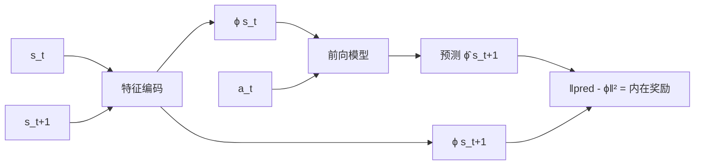

# 6. 探索策略（Exploration）

## 6.1 为什么探索是 RL 的核心难题？

ε-greedy 在简单问题上够用，但在**奖励稀疏**（如 Montezuma's Revenge）的环境里会卡死：智能体随机走永远拿不到第一个奖励。

## 6.2 主流探索范式

### A. Count-based
- 给"很少访问的状态"额外的内在奖励 $r^i \propto 1/\sqrt{N(s)}$
- 高维状态用 hash / pseudo-counts

### B. 好奇心（Curiosity）

**ICM (Intrinsic Curiosity Module)**：
- 学一个前向模型 $\hat{s}_{t+1} = f(s_t, a_t)$
- 内在奖励 = 预测误差（"惊讶程度"）

### C. RND (Random Network Distillation)
- 一个固定随机网络 + 一个学习网络
- 学习网络去拟合随机网络的输出
- 拟合误差 = 内在奖励
- **超级简单且强力**，Montezuma's Revenge 通关的关键

### D. NoisyNet
- 在网络参数上加高斯噪声 $w = \mu + \sigma \cdot \epsilon$
- 探索内嵌在网络中

## 6.3 何时需要专门的探索模块

简单环境（CartPole、LunarLander）用 ε-greedy / 策略熵正则就够用。下面这些情况下，应优先考虑 ICM / RND / NoisyNet 等方案：

- 奖励**极度稀疏**或只有终态奖励（Montezuma's Revenge、长 horizon 探索类游戏）
- 状态空间巨大且大部分区域 agent 从未访问过
- 需要"主动收集信息"的任务（探索式驾驶、世界模型预训练）

反之，定位/导航这类问题的 reward 通常比较密集（每步都能拿到与真值的距离），简单的 ε-greedy 一般已经够用。如果环境本身 reward 已经较密集，盲目加内在奖励有时反而会引入额外的方差与不稳定，需要先做对照实验。

## 进一步阅读

- ICM: Pathak et al. 2017, ["Curiosity-driven Exploration..."](https://arxiv.org/abs/1705.05363)
- RND: Burda et al. 2018, ["Exploration by Random Network Distillation"](https://arxiv.org/abs/1810.12894)
