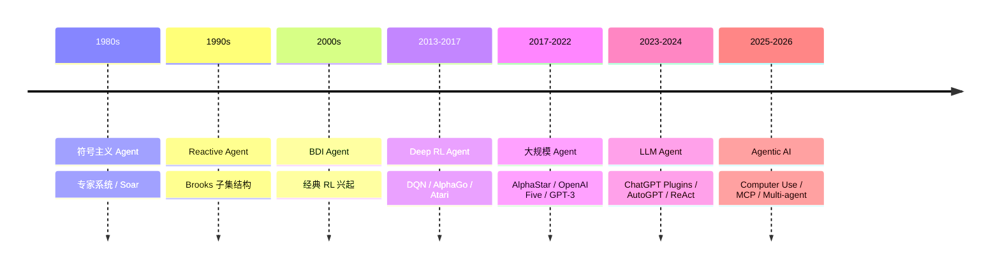

# 1. Agent 概念演进

## 1.1 时间线



## 1.2 经典 Agent 定义（Russell & Norvig）

> Agent 是任何能感知环境（through sensors）并通过执行器（actuators）作用于环境的实体。

四大类型：
1. **Simple Reflex Agent**：if-then 规则
2. **Model-based Reflex Agent**：维护内部状态
3. **Goal-based Agent**：搜索/规划达到目标
4. **Utility-based Agent**：最大化效用函数（≈ RL）

## 1.3 现代 LLM Agent 的关键能力

| 能力 | 实现 |
|-----|------|
| 推理 (Reasoning) | Chain-of-Thought, Tree-of-Thought |
| 规划 (Planning) | ReAct, Plan-and-Execute |
| 工具使用 (Tool Use) | Function Calling, MCP |
| 记忆 (Memory) | 短期 context / 长期 vector DB |
| 反思 (Reflection) | Reflexion, Self-Critique |
| 多智能体协作 | AutoGen, CrewAI |

## 1.4 为什么 LLM Agent 是范式转移？

```
传统：你训练一个针对特定任务的 RL agent，环境/任务变了就要重训
LLM Agent：你 prompt 一个通用 LLM，告诉它任务和工具，它自己想办法完成
```

但 LLM Agent 也有**根本局限**：
1. 高延迟（每步 LLM 调用 1-10s）
2. 不确定（每次响应可能不同）
3. 高成本（API 费）
4. 上下文窗口限制（虽然在变长）
5. 数学/计算能力弱（需要工具补足）

## 1.5 RL 仍然是 LLM Agent 的关键技术

- **RLHF / DPO**：让 LLM 对齐人类偏好（GPT-4 / Claude / DeepSeek 等）
- **GRPO**：DeepSeek-R1 用来做推理增强
- **Agent Tuning with RL**：让 LLM 通过试错学会用工具

→ 详见 `03_rlhf.md`
