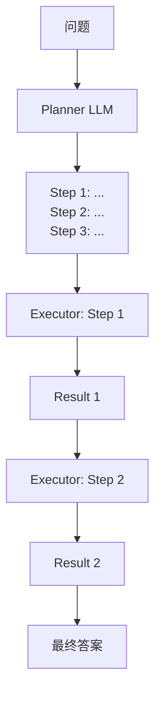

# 2. ReAct 模式与规划范式

## 2.1 ReAct = Reasoning + Acting

最早的 LLM Agent 范式（Yao et al. 2022）。让 LLM 交替输出**思考 (Thought)** 和**动作 (Action)**：

```
Question: 北京到上海高铁多久？

Thought 1: 我需要查询火车时刻表。
Action 1: search("北京到上海 高铁时长")
Observation 1: G1次列车4小时18分钟
Thought 2: 我已经获得了答案。
Action 2: answer("约 4 小时 18 分钟")
```

**关键**：把 reasoning 步骤暴露在 prompt 中 → LLM 学会"边想边做"。

## 2.2 prompt 模板

```python
REACT_PROMPT = """You are an agent. Use tools to answer questions.
Available tools: search, calculator, answer

Format strictly:
Thought: <reasoning>
Action: <tool_name>(<args>)
Observation: <tool_output>
... (repeat as needed)
Action: answer(<final_answer>)

Question: {question}
"""
```

## 2.3 Plan-and-Execute

ReAct 的问题：每步都让 LLM 想全局，token 消耗大、容易偏题。

**Plan-and-Execute**：先让 Planner 生成一个完整计划，再让 Executor 一步步执行。



## 2.4 Reflexion / Self-Critique

让 Agent 在每次行动后**自我批评**，如果错了重试：

```
Trial 1: ... 失败
Reflection: 我失败的原因是 X，下次应该 Y
Trial 2: ... 成功
```

## 2.5 Tree-of-Thought / Graph-of-Thought

把推理建模成树/图，做 BFS/DFS 搜索。比单线 CoT 强但贵很多倍。

## 2.6 与定位场景

弱相关，但有些可能场景：
- **诊断 Agent**：定位精度异常时，自动调用日志查询、地图比对、模型 inference 等工具排查
- **数据挖掘 Agent**：从街景/POI/用户反馈自动发现地图变更并提交

## 进一步阅读

- ReAct: Yao et al. 2022, ["ReAct: Synergizing Reasoning and Acting in LMs"](https://arxiv.org/abs/2210.03629)
- Reflexion: Shinn et al. 2023
