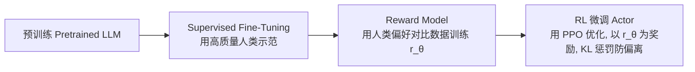

# 3. RLHF / DPO / GRPO：用 RL 对齐 LLM

## 3.1 RLHF 三阶段（ChatGPT/Claude 标准流程）



### Stage 1: SFT
监督微调，让模型学会回答问题的"格式"。

### Stage 2: Reward Model
给定一对回答 $(y_w, y_l)$（人类标注 $y_w$ 比 $y_l$ 好），训练：

$$L(r_\theta) = -\mathbb{E}_{(x, y_w, y_l)}\big[\log \sigma(r_\theta(x, y_w) - r_\theta(x, y_l))\big]$$

（Bradley-Terry 模型）

### Stage 3: PPO 微调

$$\max_\pi \mathbb{E}_{x \sim \mathcal{D}, y \sim \pi}[r_\theta(x, y)] - \beta \, D_{KL}(\pi \| \pi_{\text{SFT}})$$

把每个 token 当 action，整段回答当 trajectory，reward model 给最终 reward。

## 3.2 DPO (Direct Preference Optimization, 2023)

**洞察**：RLHF 的 PPO 很复杂（需要 RM、actor、critic、ref 等多个网络）。能否直接从偏好数据学策略？

DPO 推导出闭式解：

$$L_{DPO} = -\mathbb{E}_{(x, y_w, y_l)}\Big[\log \sigma\big(\beta \log \frac{\pi_\theta(y_w|x)}{\pi_{ref}(y_w|x)} - \beta \log \frac{\pi_\theta(y_l|x)}{\pi_{ref}(y_l|x)}\big)\Big]$$

**优点**：
- 无需训 RM，无需 PPO，纯监督式损失
- 稳定、易实现
- 当前开源社区主流（Llama-3、Qwen 等都用）

**缺点**：
- 只能用偏好对，不能用 scalar reward
- 性能上限略低于 PPO（在某些任务）

## 3.3 GRPO (Group Relative Policy Optimization, DeepSeek-R1)

DeepSeek-R1 把 RL 推到推理任务上。GRPO 的关键创新：

1. **不需要 critic/value 网络**（节省一半算力）
2. 对每个 prompt 采样 G 个 response，用**组内相对 reward** 算 advantage：
   $$\hat{A}_i = \frac{r_i - \text{mean}(r_1, ..., r_G)}{\text{std}(r_1, ..., r_G)}$$
3. 然后用 PPO-clip 风格的损失更新

**用途**：让 LLM 学会推理（数学、代码），reward 来自验证器（标准答案对比、单元测试通过等）→ **不需要 RM 也能 RL！**

## 3.4 三者对比

| | PPO RLHF | DPO | GRPO |
|--|---------|-----|------|
| 训练阶段 | SFT + RM + PPO | SFT + DPO | SFT + GRPO |
| 需要 RM？ | 是 | 否 | 否（用 verifier） |
| 需要 Critic？ | 是 | 否 | 否 |
| 数据形式 | 偏好对 + 在线 rollout | 偏好对 | (prompt, verifier) |
| 复杂度 | 高 | 低 | 中 |
| 代表 | GPT-4, Claude | Zephyr, Tulu | DeepSeek-R1, o1 |

## 3.5 一个最小 DPO 实现框架

```python
def dpo_loss(model, ref_model, x, y_w, y_l, beta=0.1):
    logp_w = model.log_prob(y_w | x)
    logp_l = model.log_prob(y_l | x)
    with torch.no_grad():
        logp_w_ref = ref_model.log_prob(y_w | x)
        logp_l_ref = ref_model.log_prob(y_l | x)
    logits = beta * ((logp_w - logp_w_ref) - (logp_l - logp_l_ref))
    return -F.logsigmoid(logits).mean()
```

## 进一步阅读

- InstructGPT: Ouyang et al. 2022
- DPO: Rafailov et al. 2023, ["Direct Preference Optimization"](https://arxiv.org/abs/2305.18290)
- DeepSeek-R1: 2024 报告 https://arxiv.org/abs/2501.12948

## 面试常考点

- 解释 RLHF 三阶段
- 为什么 DPO 不需要 RM？推导一下闭式解
- GRPO 和 PPO 的核心差异
