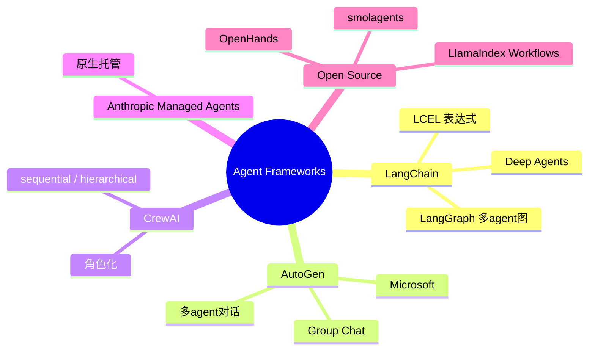

# 4. LLM Agent 框架对比

## 4.1 主流框架地图



## 4.2 LangChain / LangGraph

**LangChain**：模块化组件（LLM, Tool, Memory, Retriever, Agent Executor）
**LangGraph**：把 Agent 流程画成有向图，支持循环、分支、人工介入

```python
from langgraph.graph import StateGraph, END

def reason(state): ...
def act(state): ...
def should_continue(state):
    return "act" if state["needs_tool"] else END

g = StateGraph(AgentState)
g.add_node("reason", reason)
g.add_node("act", act)
g.add_edge("act", "reason")
g.add_conditional_edges("reason", should_continue)
g.set_entry_point("reason")
app = g.compile()
```

## 4.3 AutoGen (Microsoft)

主打**多 agent 对话**：

```python
from autogen import AssistantAgent, UserProxyAgent, GroupChat, GroupChatManager

assistant = AssistantAgent("coder", llm_config={...})
critic = AssistantAgent("critic", llm_config={...})
user = UserProxyAgent("user", code_execution_config={"work_dir": "."})

groupchat = GroupChat(agents=[user, assistant, critic], max_round=10)
manager = GroupChatManager(groupchat=groupchat)
user.initiate_chat(manager, message="写一个 Python 网页爬虫")
```

特色：built-in code execution sandbox

## 4.4 CrewAI

主打**角色化协作**，人话定义 agent：

```python
from crewai import Agent, Task, Crew

researcher = Agent(role="Researcher", goal="...", backstory="...")
writer = Agent(role="Writer", goal="...", backstory="...")
task1 = Task(description="...", agent=researcher)
task2 = Task(description="...", agent=writer)
crew = Crew(agents=[researcher, writer], tasks=[task1, task2])
result = crew.kickoff()
```

适合**业务原型**，不适合复杂逻辑。

## 4.5 选型建议（2026）

| 场景 | 推荐 |
|-----|------|
| 单 agent + 工具调用 | 直接用 OpenAI/Anthropic SDK function calling |
| 复杂工作流 | **LangGraph** |
| 多 agent 协作 | **AutoGen** |
| 业务快速原型 | **CrewAI** |
| 生产级托管 | **Claude Managed Agents** |

## 4.6 入门建议

- 不要一上来就上 LangChain，**先用裸 SDK + function calling 写一个最小 agent**，理解每一步在做什么
- 真正需要复杂 graph 时再引入 LangGraph
- 多 agent 协作场景再考虑 AutoGen / CrewAI

## 进一步阅读

- LangGraph 官方教程
- AutoGen Studio
