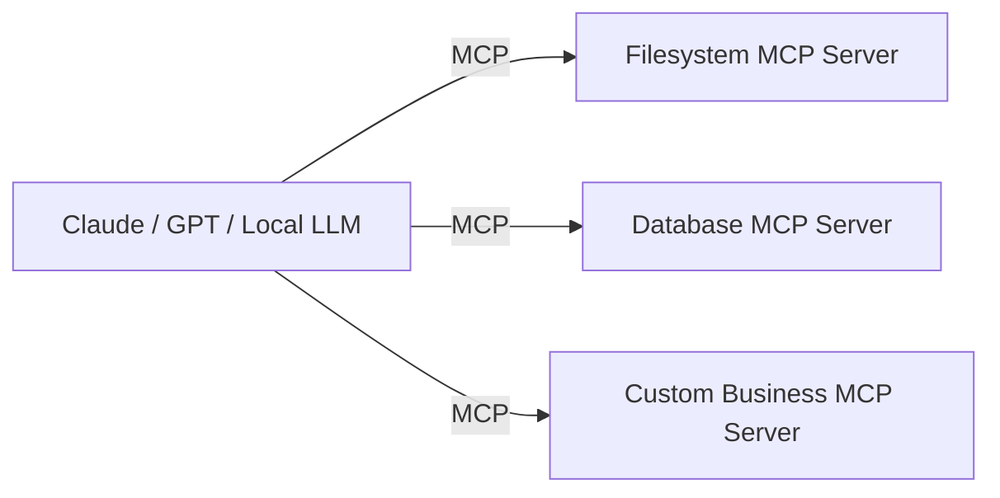

# 5. 工具调用：Function Calling / MCP / Computer Use

## 5.1 Function Calling

LLM 输出结构化 JSON 描述要调用哪个工具及参数：

```python
tools = [{
    "type": "function",
    "function": {
        "name": "get_weather",
        "description": "获取城市天气",
        "parameters": {
            "type": "object",
            "properties": {"city": {"type": "string"}},
            "required": ["city"]
        }
    }
}]

response = client.chat.completions.create(
    model="gpt-4o", messages=[...], tools=tools
)
# response.choices[0].message.tool_calls -> 调用列表
```

主流家家都支持：OpenAI / Anthropic / Google / DeepSeek / Qwen。

## 5.2 MCP (Model Context Protocol)

Anthropic 2024 开源的协议，**统一不同 LLM 与工具的接口**。



**意义**：避免每接一个 LLM 都重写一次 tool 适配。Cursor/Claude Desktop/Cline 等都已支持。

## 5.3 Computer Use

让 LLM **直接操作鼠标键盘**：截屏 → 推理下一步动作 → 输出鼠标坐标/键盘命令。

代表：
- Anthropic Claude Computer Use (2024-10)
- OpenAI Operator (2025)
- 各种 Browser Agent

**给 RL 的启示**：未来的 LLM Agent 训练会越来越像 RL —— 状态是屏幕截图，动作是 GUI 操作，reward 来自任务完成情况。

## 5.4 工具学习的 RL 化

让 LLM 学会**何时调用工具、调用哪个**：
- 用 RL 优化 tool-use 策略（reward = 任务完成度）
- 代表：Toolformer, Gorilla, ToolLLM

## 5.5 给定位场景的小例子（虚构）

```python
def localization_assist_tools():
    return [
        {"name": "query_high_def_map", "params": {"lat": float, "lon": float, "radius": float}},
        {"name": "query_satellite_status", "params": {"prn_list": list}},
        {"name": "run_kalman_filter", "params": {"obs": list}},
        {"name": "explain_anomaly", "params": {"trace_id": str}},
    ]
```

→ 内部"定位排障 Agent"可以自己调用这些工具排查为什么某用户某时刻定位漂移。

## 进一步阅读

- MCP 官方文档：https://modelcontextprotocol.io/
- Toolformer: Schick et al. 2023
