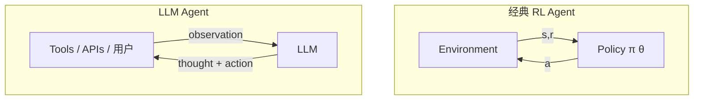

# 05 LLM Agent 时代的 RL

> **本章定位**：2023 之后，"Agent" 这个词的含义从「RL agent」逐渐扩展到「LLM agent」。本章帮你理解这两个世界的交集与差异。

## 文件列表

| 文件 | 主题 |
|-----|-----|
| [01_agent_concept.md](./01_agent_concept.md) | Agent 概念演进：从 RL agent 到 LLM agent |
| [02_react_pattern.md](./02_react_pattern.md) | ReAct / Plan-and-Execute / 推理-行动循环 |
| [03_rlhf.md](./03_rlhf.md) | RLHF / DPO / GRPO：用 RL 对齐 LLM |
| [04_frameworks.md](./04_frameworks.md) | LangChain / LangGraph / AutoGen / CrewAI |
| [05_tool_use.md](./05_tool_use.md) | Function Calling / MCP / Computer Use |

## 两个 Agent 世界

**核心相似**：都是 perception → decision → action 闭环
**核心差异**：

| | 经典 RL Agent | LLM Agent |
|--|-------------|-----------|
| 决策器 | 神经网络 π_θ（小） | LLM（巨大） |
| 训练方式 | 大量交互试错 | 预训练 + 指令微调 + RLHF |
| 状态/动作空间 | 数值向量/离散/连续 | 自然语言 |
| 推理能力 | 弱（end-to-end） | 强（CoT、Plan） |
| 部署成本 | 低 | 高（每步 API 调用） |
| 数据效率 | 极低 | 极高（zero-shot） |

## 对地图业务的启示

地图业务里 LLM Agent 的潜在场景：
- **导航助手**：自然语言路径规划（"避开拥堵走一条经过咖啡店的路"）
- **POI 推荐 Agent**：理解用户意图选择推荐策略
- **数据标注/挖掘 Agent**：自动从街景图发现 POI 变更
- **客服/问询 Agent**

但**核心定位算法（GNSS/SLAM）暂时不会被 LLM 取代** —— 高频、低延迟、确定性需求决定了仍是经典 RL/优化的天下。
