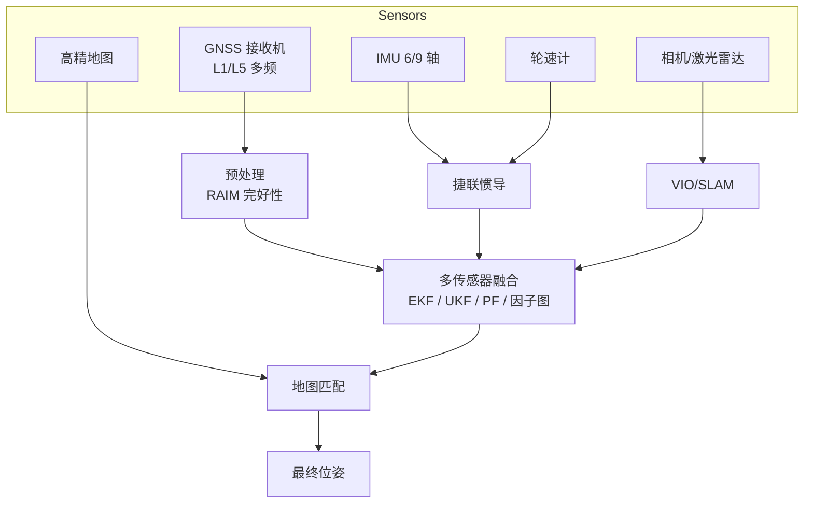
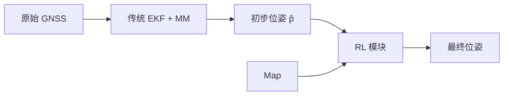
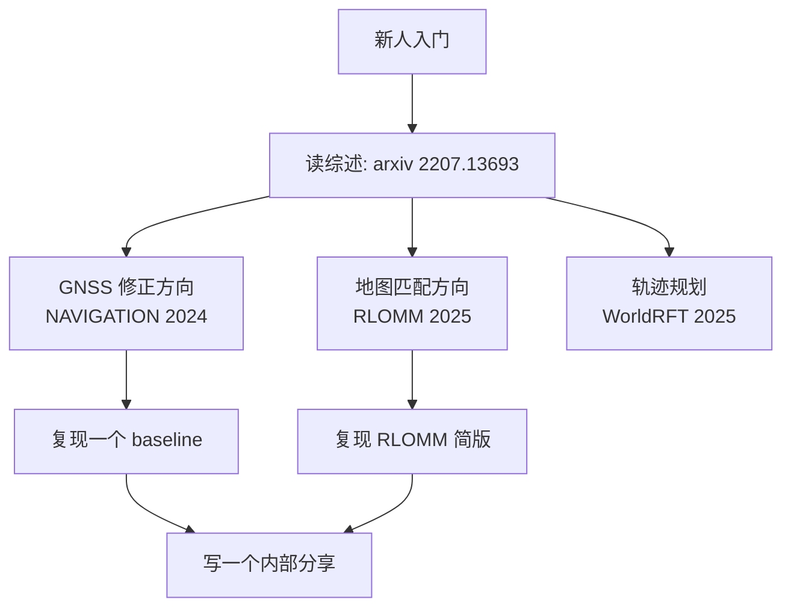

# 1. 定位 vs RL：传统算法对比与切入点

## 1.1 传统定位算法栈



**核心方法**：
- **EKF / UKF**：扩展/无迹卡尔曼滤波
- **Particle Filter**：粒子滤波
- **Factor Graph (GTSAM/Ceres)**：因子图优化
- **HMM**：隐马尔可夫地图匹配
- **A***：路径规划

## 1.2 这些方法的痛点

| 模块 | 痛点 |
|------|-----|
| EKF | 假设线性高斯，强非线性时发散；噪声协方差靠经验调 |
| PF | 高维状态退化（degeneracy） |
| HMM 地图匹配 | 分歧路口、遮挡区域错误率高 |
| A* / Dijkstra | 无个性化、不会动态学习用户偏好 |
| 多传感器融合 | 何时信哪个传感器全靠规则 |

## 1.3 RL 的切入点矩阵

```
                离散决策                       连续控制
            ┌──────────────────────┬──────────────────────┐
传感器/参数  │ 选哪些卫星/传感器       │ 自适应 KF 噪声协方差    │
选择        │ DQN / Bandit          │ DDPG / SAC            │
            ├──────────────────────┼──────────────────────┤
位置/状态   │ 路径段选择 (MM)         │ 连续位置修正残差        │
修正        │ DQN                  │ PPO / SAC             │
            └──────────────────────┴──────────────────────┘
```

## 1.4 RL 在定位的"加值方式"



RL 学的是「**残差修正**」：在传统输出基础上做小幅微调。
**好处**：训练目标清晰、有 fallback、可解释、可上线。

## 1.5 为什么不是端到端 RL？

理论上你可以让 RL 直接吃原始 GNSS 字节流输出经纬度。但：
- 训练不收敛
- 物理意义丢失
- 一旦 OOD 就崩
- 没法做完好性监控

**业界共识**：**保留物理模型作骨架，RL 作肌肉**。

## 1.6 论文阅读地图



## 1.7 推荐工具与数据集

| 工具/数据 | 用途 |
|----------|-----|
| **Google Smartphone Decimeter Challenge dataset** | 真实手机 GNSS + 真值，免费 |
| **KITTI / nuScenes** | 自动驾驶场景的 GNSS + IMU + Lidar + 真值 |
| **OpenStreetMap (OSM)** | 路网数据 |
| **CARLA / SUMO** | 仿真器 |
| **RTKLIB** | 开源 GNSS 处理 |
| **GTSAM / Ceres** | 因子图优化 |
| **gymnasium** | 自定义 RL 环境的标准 API |

下一节进入 **GNSS 修正** 的具体方法。
