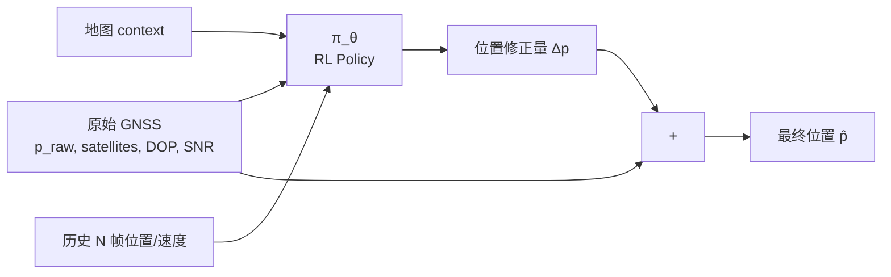

# 2. GNSS 城市峡谷定位修正

> **核心论文**：*Improving GNSS Positioning Correction Using Deep Reinforcement Learning with an Adaptive Reward Augmentation Method*, NAVIGATION (Journal of the Institute of Navigation), Vol. 71, No. 4, 2024.

## 2.1 问题：为什么 GNSS 在城市那么飘？

```
                  卫星
                /  |  \
               /   |   \
              /    |    \  
        ┌────┴────┴────┴────┐
        │                    │
        │  ┌──┐    ┌──┐      │  <- 高楼
        │  │  │    │  │      │  
        │  │  │ X  │  │      │  X = 你的车
        │  └──┘    └──┘      │  ↑ 卫星信号
        └────────────────────┘    被楼挡 (NLOS)
                                  反射后到达 (Multipath)
```

3 大恶因：
1. **多径 (Multipath)**：信号反射后到达，伪距测错
2. **NLOS (Non-Line-of-Sight)**：直射被挡，只收到反射
3. **可视卫星少 + 几何分布差 (高 DOP)**

→ 单点定位误差从 5m 飙到 50m+。

## 2.2 传统解决方案

| 方法 | 思路 | 局限 |
|-----|-----|------|
| **3D Building Model** | 用 3D 城市模型预测哪些卫星 NLOS | 需要 3DBM，且实时计算重 |
| **C/N0 Weighting** | 信噪比低的卫星权重小 | 多径信号可能 SNR 也高 |
| **PPP / RTK** | 差分定位，分米级 | 需要基站，城市穿透差 |
| **Tightly Coupled INS/GNSS** | 用 IMU 短时弥补 | 漂移累积 |
| **Map Matching** | 把位置投到道路上 | 平行路、立交错误 |

## 2.3 RL 怎么帮？

**思路**：直接学一个修正策略，输入原始 GNSS + 上下文，输出位置修正量。



## 2.4 NAVIGATION 2024 论文要点

### MDP 建模

| 元素 | 设计 |
|------|-----|
| State | 当前位置 + 速度 + 卫星观测特征（每颗：SNR、仰角、伪距残差）+ 历史 5 帧 |
| Action | 二维位置修正 $(\Delta x, \Delta y) \in [-15m, 15m]^2$（连续） |
| Reward | $-\|p^{est} - p^{truth}\|_2$ + 自适应增强项 |
| 算法 | **PPO**（连续动作 + 稳定） |

### 自适应 Reward Augmentation（论文核心创新）

问题：纯 $-\|\cdot\|$ reward 太稀疏（误差大时只告诉你"差"，不告诉你方向）。

解法：根据**当前误差大小**动态调整 reward 形状：

$$r_t = -d_t + \alpha \cdot \text{shaping}(d_t, d_{t-1})$$

其中 shaping 项鼓励**误差减小的方向**。

### 数据来源
- 用差分 GNSS / RTK 提供真值
- 城市数据稀缺 → 用仿真 + 真实数据混合训练

### 性能
- 城市峡谷场景下 **平均误差降低 30%+**
- 相比纯 EKF baseline，对 NLOS 场景鲁棒

## 2.5 自己怎么实现一个最小版？

### Step 1: 收集 / 仿真数据

可用 **Google Smartphone Decimeter Challenge** 的 Kaggle 数据集：
- 6+ 小时手机 GNSS 数据
- 包含真值（差分定位）
- 多个城市

### Step 2: 设计 Gym 环境

```python
class GNSSCorrectionEnv(gym.Env):
    def __init__(self, trajectory_data):
        self.data = trajectory_data       
        self.observation_space = spaces.Box(low=-np.inf, high=np.inf, shape=(64,))
        self.action_space = spaces.Box(low=-15, high=15, shape=(2,))
    
    def reset(self):
        self.idx = 0
        return self._get_obs(), {}
    
    def step(self, action):
        p_raw = self.data[self.idx]['p_raw']
        p_truth = self.data[self.idx]['p_truth']
        p_corrected = p_raw + action
        reward = -np.linalg.norm(p_corrected - p_truth)
        self.idx += 1
        done = self.idx >= len(self.data) - 1
        return self._get_obs(), reward, done, False, {}
    
    def _get_obs(self):
        ...
```

### Step 3: 训练 PPO

```python
from stable_baselines3 import PPO
model = PPO("MlpPolicy", env, verbose=1, tensorboard_log="./gnss_logs")
model.learn(total_timesteps=500_000)
```

### Step 4: 评估
- 与 baseline EKF 对比 RMS / CDF
- 分场景：开阔 / 街道 / 峡谷 / 隧道边界

→ 见 `../07_projects/project5_gnss_correction_rl/`

## 2.6 进一步思考

- **Q**: 为什么不端到端学伪距 → 位置？
  **A**: 端到端丢物理结构、训练困难、OOD 风险大。先用 LSE 解出粗位置再做修正。

- **Q**: 怎么处理 reward 稀疏（无真值时段）？
  **A**: 用 self-supervised reward（地图约束、时序一致性）

- **Q**: 怎么部署到端上？
  **A**: 模型蒸馏到 MLP < 1MB，端侧推理 < 1ms

## 进一步阅读

- *Improving GNSS Positioning Correction Using DRL with Adaptive Reward Augmentation*, NAVIGATION 2024
- *Fusing Vehicle Trajectories and GNSS Measurements... Actor-Critic Learning*, ION GNSS+ 2023
- Sun et al., *Increasing GPS Localization Accuracy with RL*, IEEE TITS 2020
