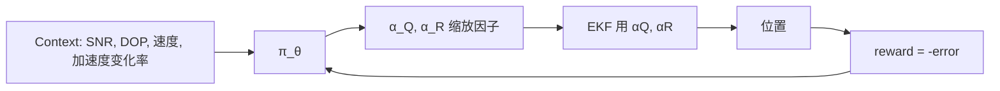

# 3. RL 辅助多传感器融合

## 3.1 经典 EKF 回顾

预测：
$$\hat{x}_{k|k-1} = F \hat{x}_{k-1|k-1}, \quad P_{k|k-1} = F P F^T + \mathbf{Q}$$

更新：
$$K_k = P_{k|k-1} H^T (H P_{k|k-1} H^T + \mathbf{R})^{-1}$$
$$\hat{x}_{k|k} = \hat{x}_{k|k-1} + K_k(z_k - H\hat{x}_{k|k-1})$$

**关键参数**：
- $\mathbf{Q}$：过程噪声协方差（运动模型不准的程度）
- $\mathbf{R}$：观测噪声协方差（GPS 信号不准的程度）

**痛点**：$\mathbf{Q}, \mathbf{R}$ 工程上靠经验调，**且环境一变就不对**（开阔 vs 城市）。

## 3.2 RL 自适应噪声协方差

**思路**：用 RL 学一个策略，根据当前 context 动态输出 $\mathbf{Q}, \mathbf{R}$ 的缩放因子。



### 状态/动作设计

| 元素 | 设计 |
|------|-----|
| State | 滑窗内的：SNR 均值/方差、DOP、速度变化、innovation 序列 |
| Action | $\log(\alpha_Q), \log(\alpha_R)$（取 log 让取值范围更友好） |
| Reward | $-\|p^{est} - p^{truth}\|$（有真值）或 $-\|innovation\|^2$（无真值） |
| 算法 | **SAC**（连续动作 + 样本效率高） |

### 训练流程

```python
class AdaptiveEKFEnv(gym.Env):
    def __init__(self, traj_data):
        self.ekf = EKF()              
        self.data = traj_data
        self.observation_space = spaces.Box(...)
        self.action_space = spaces.Box(low=[-2,-2], high=[2,2], shape=(2,))
    
    def step(self, action):
        alpha_Q, alpha_R = np.exp(action)
        z = self.data[self.idx]['gnss']
        x_est = self.ekf.update(z, Q=self.Q0*alpha_Q, R=self.R0*alpha_R)
        truth = self.data[self.idx]['truth']
        reward = -np.linalg.norm(x_est[:2] - truth[:2])
        ...
```

## 3.3 RL 选择传感器组合

**场景**：手机有 GPS、Wi-Fi 定位、蓝牙 Beacon、IMU。每种功耗不同、精度不同。如何动态选用？

→ **离散动作 RL（DQN）**：
- State：电量、当前速度、信号强度、上次定位置信度
- Action：{只用 GPS, GPS+IMU, GPS+WiFi, 全开, 关闭定位}
- Reward：精度 + 功耗权衡 $r = -d - \lambda \cdot \text{power}$

## 3.4 因子图 + RL

更前沿方向：用 RL 优化因子图中各因子的**权重**（weight）。
- 因子图（GTSAM）做后端非线性优化
- RL 决定每个观测因子有多 trust

## 3.5 实际部署经验（业界）

| 经验 | 说明 |
|-----|-----|
| RL 必须有 fallback | 万一 RL 输出离谱值，回退到默认 Q/R |
| 安全约束必须硬约束 | 修正量 > 50m 直接 reject |
| 模型必须小 | 通常 < 100KB，端侧 < 1ms |
| 离线训 + 在线微调 | 离线学一个通用策略，端侧 fine-tune |

## 3.6 思考练习

设计一个 MDP：
- 你有 IMU + GPS。GPS 来 1Hz，IMU 来 100Hz。
- IMU 有 bias 漂移。
- 任务：什么时候 trust GPS（更新位置），什么时候只信 IMU（推算）？

→ 这是经典的 **GNSS/INS Tightly Coupled** 问题，工业里常用，可以试试用 RL 重做。

## 进一步阅读

- Brown & Hwang, *Introduction to Random Signals and Applied Kalman Filtering*（基础）
- Hu et al., *Adaptive Kalman Filter using Deep RL*, IEEE Sensors 2021
- 因子图：[GTSAM 教程](https://gtsam.org/tutorials/intro.html)
