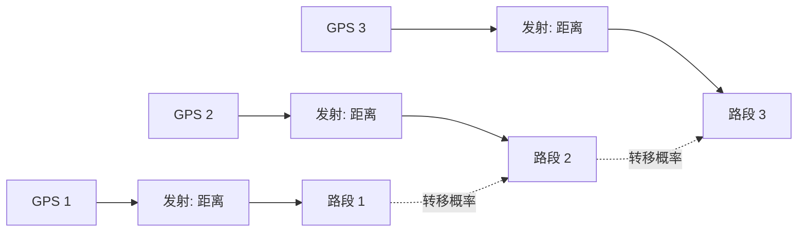
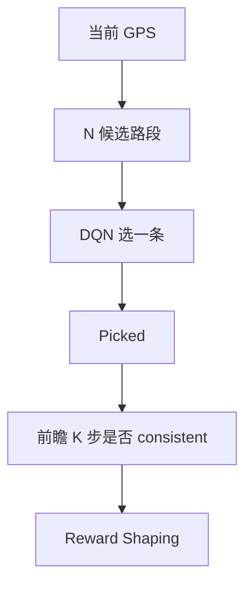
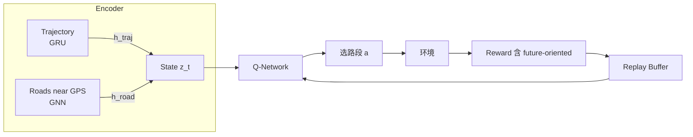

# 4. 在线地图匹配：RLOMM 详解

> **核心论文**：*RLOMM: An Efficient and Robust Online Map Matching Framework with Reinforcement Learning*, arxiv 2502.06825, 2025.

## 4.1 什么是地图匹配 (Map Matching, MM)？

把 GPS 轨迹"贴"到道路网络上：

```
            GPS 点 (噪声)
              ●
                ●
            ●
              ●
                  ●
   ━━━━━━━━━━━━━━━━━━ 道路 1
              ●     ●
   ━━━━━━━━━━━━━━━━━━ 道路 2

      问题：每个 GPS 点真正在哪条路？
```

## 4.2 传统方法：HMM 地图匹配



- **发射概率**：GPS 点距离路段中线的距离 → 高斯
- **转移概率**：从路段 i 到路段 j 的可达性
- **Viterbi** 解最优路径

**痛点**：
1. 路口分歧（三岔口）容易错
2. 平行路（高架/辅路）容易错
3. 实时性差（Viterbi 需要往后看）

## 4.3 RLOMM 的核心创新

### 把 MM 建模成 OMDP（Online MDP）

| 元素 | 设计 |
|------|-----|
| State | 历史 K 步轨迹 embedding + 当前 GPS 周围候选路段 embedding |
| Action | 选哪条候选路段（离散，N 个候选） |
| Reward | 是否匹配正确（+1/-1）+ **future-oriented reward**（考虑下游一致性） |
| 算法 | **DQN 风格 + 自定义 reward shaping** |

### 关键技术点

**1. 双重图表示 + GNN**
- 轨迹图：GPS 点序列 → GRU/RNN 编码
- 路网图：道路拓扑 → GNN 编码

**2. 对比学习对齐**
- 把"轨迹 embedding"和"正确路段 embedding"在 latent 空间拉近
- 错的拉远

**3. Future-Oriented Reward**
- 不只看当前匹配是否对
- 还看：基于当前选择，未来 K 步是否仍 plausible
- 这能避开"贪心局部正确但全局错误"



## 4.4 整体架构



## 4.5 性能（论文报告）

- 比传统 HMM (Hidden Markov Map Matching) 准确率提升 **5-10%**
- 复杂城市路网下提升更显著
- 在线推理：单步 < 5ms

## 4.6 自己复现一个简化版

我们在 `../07_projects/project4_map_matching_rl/` 提供一个最小 demo：
- 玩具路网（5 路段）
- 噪声 GPS 轨迹
- DQN 选择当前所在路段
- 与朴素最近邻 baseline 对比

## 4.7 工业落地考量

| 项 | 说明 |
|---|------|
| 路网规模 | 中国全国路网亿级，候选路段 query 是瓶颈 → 用空间索引（R-tree） |
| 多样化路网 | 高架/隧道/辅路必须特殊处理 |
| 端云协同 | 高频实时在端，低频校正在云 |
| 与 EKF 配合 | RLOMM 提供路段后，可作为 EKF 的强约束 |

## 4.8 思考练习

1. RLOMM 是 on-policy 还是 off-policy？为什么？
2. 在 reward 里加什么项可以让 agent 偏好"避免在路口附近频繁切换路段"？
3. 如果路网有 1 万条候选，DQN 输出层维度 1 万，怎么办？（提示：基于 attention 的 candidate scoring）

## 进一步阅读

- 原文 RLOMM: https://arxiv.org/abs/2502.06825
- HMM Map Matching 经典：Newson & Krumm 2009
- 综述：Hsueh & Chen 2018, *Map Matching for Low-Sampling-Rate GPS Trajectories*
