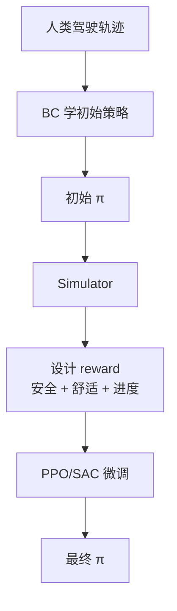
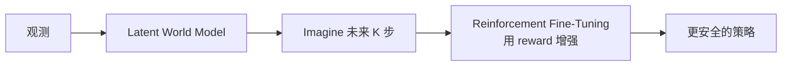

# 5. 轨迹预测与规划

## 5.1 任务区分

| 任务 | 输入 | 输出 |
|-----|-----|-----|
| **轨迹预测 (Prediction)** | 周围车辆历史轨迹 | 未来 5s 各车的可能轨迹（多模态） |
| **轨迹规划 (Planning)** | 自车状态 + 周围预测 + 地图 | 自车未来 5s 的执行轨迹 |
| **运动控制** | 规划轨迹 | 方向盘/油门/刹车 |

→ **轨迹预测属于"感知"，轨迹规划属于"决策"**。RL 主要用在后者。

## 5.2 传统规划方法

| 方法 | 描述 | 局限 |
|-----|-----|-----|
| A* / Hybrid A* | 离散搜索 | 不考虑动态障碍物 |
| RRT* | 随机树 | 抖动，需要后处理平滑 |
| Frenet Frame + 多项式 | 沿参考线生成 | 参数全靠手调 |
| 最优控制 (MPC) | 滚动优化 | 模型不准 / 计算重 |
| 行为树 + 规则 | 工程化 | 维护成本高 |

## 5.3 RL 在规划上的两大流派

### A. 端到端 RL 规划

直接 state → 控制信号。
- 训练难收敛
- 不可解释
- 安全难保证
- → 一般在仿真，少有上路

### B. 强化模仿学习（Reinforced Imitation Learning）★ 主流

**代表论文**：*Reinforced Imitative Trajectory Planning for Urban Automated Driving* (arxiv 2410.15607, 2024)
- Transformer 做 reward model
- 用 nuPlan 数据集

### C. 世界模型（WorldRFT, 2025）

在 nuScenes / NavSim 上 SOTA，碰撞率降低 83%。

## 5.4 给定位算法岗的视角

虽然你不直接做规划，但理解规划对你有帮助：

1. **规划需要稳定的定位** —— 你的工作直接影响下游
2. **预测需要历史轨迹** —— MM 的输出常被用作预测输入
3. **未来定位会和规划耦合**：基于"我接下来会走哪条路"反过来辅助 GNSS 修正（**逆向因果建模**）

## 5.5 公开 Benchmark

| Benchmark | 类型 | 用途 |
|-----------|-----|------|
| **nuPlan** | 闭环规划 | 真实驾驶数据 + 仿真器 |
| **nuScenes** | 预测/感知 | 1000 段驾驶 |
| **NavSim** | 闭环仿真 | nuPlan 的简化版 |
| **CARLA** | 全开源仿真 | 训练/测试 RL |
| **Waymo Open Dataset** | 预测/感知 | Google 公开 |

## 进一步阅读

- *Reinforced Imitative Trajectory Planning*, arxiv 2410.15607
- *WorldRFT*, arxiv 2512.19133
- 综述：*Trajectory Prediction for Autonomous Driving*, arxiv 2503.03262
