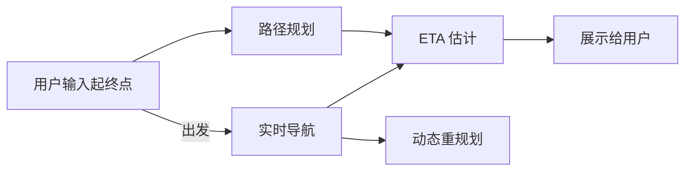
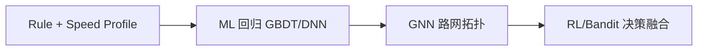

# 6. 路径规划与 ETA：RL 在导航服务中的应用

## 6.1 高德/百度/滴滴的实际场景

每个环节都有 RL 的机会。

## 6.2 路径规划

### 经典：A* / Dijkstra
- 全局最短路
- 需要边权重（距离/时间/路况）

### 痛点
- 边权重静态 → 实时路况变化
- 用户偏好不同（避开高速、走街道）
- 多目标权衡（时间 vs 距离 vs 油耗）

### RL 的角色

**A: 个性化路径排序**
- A* 出 K 条候选路径
- RL（contextual bandit）根据用户特征排序
- Reward = 用户是否选择 / 是否完成

**B: 动态边权重学习**
- GNN + RL 学路网每条边的"实时通行成本"
- 输入：天气、时段、历史拥堵、事件
- 输出：动态权重，A* 用它

**C: 端到端路径生成**
- LLM Agent / 自回归生成
- 比较前沿，未广泛上线

## 6.3 ETA 估计

### 经典方法演进

### RL 在 ETA

ETA 大头是监督学习问题（有大量历史真值），但**几个角落 RL 有用**：

1. **置信区间动态调整**：根据当前不确定性 RL 决定给用户报"5-7 分钟"还是"6 分钟"
2. **多模型融合**：有多个 ETA 模型（短时/长时/不同区域），RL 选用哪个
3. **用户感知优化**：用户更在意"早到惊喜"还是"准时" → RLHF 风格优化

### 滴滴 / Uber 实践（公开论文）

- **滴滴 WDR / DeepETA**：DNN + Wide & Deep
- **Uber DeepETA (2022)**：Transformer
- 都还是监督学习为主，RL 增量

## 6.4 拼车/订单调度（外延）

不直接是定位算法，但同部门可能涉及：
- 司机派单：MARL（每个司机一个 agent）
- 动态定价：contextual bandit / RL
- 滴滴有大量 KDD/SIGKDD/NeurIPS 论文，可作为参考

## 6.5 给岗位的实战建议

| 想做什么 | 建议路径 |
|--------|---------|
| 想做 GNSS 修正 | 先吃透 KF/PF，再做 RL 增量 |
| 想做地图匹配 | 看 RLOMM，复现简版 |
| 想做 ETA / 路径 | 先做监督学习 baseline，再上 RL |
| 想做端到端 | 入职 1 年内别想，会被劝退 |

## 进一步阅读

- 滴滴技术博客 https://tech.didiglobal.com/
- *DeepETA: How Uber Predicts Arrival Times Using Deep Learning*, Uber Engineering 2022
- *DeepRoute: Herding Elephants and Mice for Path Recommendation*, KDD 2020
