# 06 定位算法专题：RL 在定位/导航中的应用 ★

> **本章是整个仓库的核心**。学完前 5 章后，请把至少 4 周时间投入这里。

## 章节速览

```mermaid
mindmap
  root((RL × 定位))
    GNSS 定位
      多径/NLOS 修正
      城市峡谷
      DRL 修正策略
    传感器融合
      RL 自适应 KF
      IMU/GNSS/Vision 选择
    地图匹配
      RLOMM 在线 MM
      路径分歧决策
    轨迹预测
      Reinforced Imitation Planning
      WorldRFT 世界模型
    路径规划
      A* + RL refinement
      个性化路径
    ETA 估计
      Bandit / Contextual
```

## 文件列表（建议按顺序阅读）

| 文件 | 主题 | 核心论文 |
|-----|-----|---------|
| [01_overview.md](./01_overview.md) | 定位 vs RL：传统算法对比与切入点 | - |
| [02_gnss_correction.md](./02_gnss_correction.md) | GNSS 城市峡谷定位修正 | NAVIGATION 2024, ION 2023 |
| [03_sensor_fusion_rl.md](./03_sensor_fusion_rl.md) | RL 辅助 Kalman Filter / 多传感器融合 | Adaptive KF with RL |
| [04_map_matching_rlomm.md](./04_map_matching_rlomm.md) | RLOMM：在线地图匹配 | arxiv 2502.06825 |
| [05_trajectory_prediction.md](./05_trajectory_prediction.md) | 轨迹预测与规划 | WorldRFT, Frenet RL |
| [06_routing_eta.md](./06_routing_eta.md) | 路径规划与 ETA | DiDi/Uber 工业实践 |
| [07_simple_gridworld_navigation.ipynb](./07_simple_gridworld_navigation.ipynb) | 网格世界中的导航 demo | - |
| [papers.md](./papers.md) | 论文阅读清单（按子领域分类） | - |

## 工业落地的真实困难

在你正式入职前，请清醒地认识到：

| 困难 | 为什么 |
|-----|-------|
| **真值数据极贵** | 厘米级定位需要差分基站、激光雷达扫图，亿级覆盖成本高 |
| **长尾场景难** | 隧道、立交、地下停车场……每一种都要单独建模 |
| **可解释性要求** | 用户投诉时你要能说清楚为什么定位这一刻不对 |
| **延迟敏感** | 端上 100Hz 定位，每帧只有 10ms，重模型部署不起 |
| **稳定性 >> 精度** | 偶发漂移 50 米 比 永远偏 5 米 严重得多 |

→ 所以工业里 RL **极少完全替换** 传统算法（KF/PF/HMM），而是作为：
1. **残差修正模块**：传统输出 + RL 微调
2. **参数自适应模块**：RL 调 KF 的 Q/R 矩阵
3. **决策融合模块**：何时相信 GPS、何时相信 IMU
4. **离线优化模块**：批处理学习路网/POI

---

## 本章学习产出（建议自我检查）

- [ ] 能用一张 PPT 讲清楚 RLOMM 的 OMDP 建模
- [ ] 能在白板上推 NAVIGATION 2024 的 GNSS 修正 reward 设计
- [ ] 完成 [Project 4: Map Matching RL](../07_projects/project4_map_matching_rl/) 的 demo
- [ ] 完成 [Project 5: GNSS Correction RL](../07_projects/project5_gnss_correction_rl/) 的 demo
- [ ] 至少精读 5 篇 [papers.md](./papers.md) 中的论文，写读书笔记
