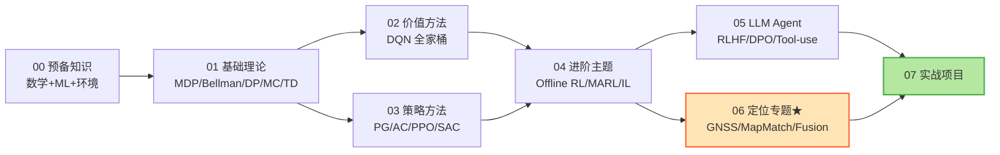

# RL_Agents：从零到工业落地的强化学习自学仓库

> **作者背景**：即将入职互联网公司地图部门 · 定位算法岗
> **学习目标**：建立扎实的 RL 理论基础 + 掌握工业界主流算法实现 + 聚焦 RL 在地图定位/导航中的应用 + 紧跟 LLM Agent 时代的演进

---

## 一、为什么这个仓库是为「定位算法岗」量身定制的？

定位算法（GNSS / 多传感器融合 / 地图匹配 / 轨迹预测）传统上由**贝叶斯滤波（Kalman / Particle Filter）+ 几何方法 + 优化**主导。但近年来，强化学习开始在以下几个方向**显著替代或增强**传统方法：

| 传统问题 | 痛点 | RL 切入方式 | 代表论文/方法 |
|---------|------|------------|--------------|
| GNSS 城市峡谷定位 | 多径、NLOS 难以建模 | 用 DRL 学一个端到端的「修正策略」 | *Improving GNSS Positioning Correction Using DRL with Adaptive Reward* (NAVIGATION 2024) |
| 在线地图匹配 (Map Matching) | HMM 在分叉路、密集路网失败 | 把匹配建模成 OMDP，用 RL 增量决策 | **RLOMM** (arxiv 2502.06825, 2025) |
| 多传感器融合 | KF 假设线性高斯，参数难调 | RL 自适应噪声协方差 / 选择传感器 | Adaptive Kalman with RL |
| 轨迹预测 / 路径规划 | 复杂城市场景泛化差 | RL + 模仿学习 + 世界模型 | **WorldRFT** (2025), Reinforced Imitative Planning |
| 路径推荐 / ETA | 规则系统难以个性化 | Contextual Bandit / RL 排序 | 高德/百度内部都有相关工作 |

**结论**：你需要既懂 RL 经典理论（面试 + 论文），又能落到工业代码（PyTorch + Gymnasium + Stable-Baselines3），更要在**第 6 章「定位算法专题」** 中啃透行业最新进展。

---

## 二、学习大纲（推荐 3-4 个月，每周 8-10 小时）



### 章节路线图

| 章节 | 内容 | 形式 | 难度 | 对岗位重要性 |
|------|------|------|-----|------------|
| [00_prerequisites](./00_prerequisites/) | 数学/ML/PyTorch/Gymnasium 速通 | md | ⭐ | ⭐⭐⭐ |
| [01_foundations](./01_foundations/) | MDP / Bellman / DP / MC / TD / Q-learning / SARSA | md + ipynb | ⭐⭐ | ⭐⭐⭐⭐⭐ |
| [02_value_based](./02_value_based/) | DQN / Double / Dueling / PER / Rainbow | md + ipynb | ⭐⭐⭐ | ⭐⭐⭐⭐ |
| [03_policy_based](./03_policy_based/) | REINFORCE / A2C / PPO / DDPG / TD3 / SAC | md + ipynb | ⭐⭐⭐⭐ | ⭐⭐⭐⭐⭐ |
| [04_advanced](./04_advanced/) | Model-based / Offline RL / MARL / IRL / Meta-RL | md | ⭐⭐⭐⭐⭐ | ⭐⭐⭐ |
| [05_llm_agents](./05_llm_agents/) | Agent 概念 / ReAct / RLHF/DPO/GRPO / LangChain | md | ⭐⭐⭐ | ⭐⭐⭐ |
| [**06_localization_rl ★**](./06_localization_rl/) | **GNSS 修正 / 地图匹配 / 传感器融合 / 轨迹预测** | md + ipynb | ⭐⭐⭐⭐ | ⭐⭐⭐⭐⭐ |
| [07_projects](./07_projects/) | 5 个递进式实战项目 | code | - | ⭐⭐⭐⭐⭐ |
| [resources](./resources/) | 经典书籍/课程/论文/工具索引 | md | - | ⭐⭐⭐ |

---

## 三、核心学习资料推荐

### 📚 必读书籍
1. **Sutton & Barto《Reinforcement Learning: An Introduction》** （免费 PDF：http://incompleteideas.net/book/the-book-2nd.html）—— 圣经，前 8 章必读
2. **《动手学强化学习》张伟楠**（中文，配 Jupyter 代码：https://hrl.boyuai.com/）—— 中文最佳入门
3. **《深度强化学习》王树森**（B站有视频）—— 公式推导清晰

### 🎓 高质量课程
1. **Hugging Face Deep RL Course**（免费、有作业、含代码）：https://huggingface.co/learn/deep-rl-course
2. **OpenAI Spinning Up**：https://spinningup.openai.com/ —— 算法实现参考
3. **David Silver UCL RL Course**（YouTube 经典）—— 理论基础
4. **CS285 (Sergey Levine, Berkeley)**—— 进阶
5. **Coursera RL Specialization (UAlberta)**—— Sutton 团队亲授

### 🛠️ 必备工具栈
- **Python 3.10+ / PyTorch 2.x**
- **[Gymnasium](https://gymnasium.farama.org/)**（OpenAI Gym 的官方继承者）
- **[Stable-Baselines3](https://stable-baselines3.readthedocs.io/)**（生产级算法实现）
- **[CleanRL](https://github.com/vwxyzjn/cleanrl)**（单文件算法实现，最适合学习）
- **Weights & Biases / TensorBoard**（实验跟踪）

### 📰 跟进前沿
- **arXiv-sanity** + **Papers With Code RL Leaderboards**
- 顶会：NeurIPS, ICML, ICLR (RL track)；定位领域：IEEE TITS, ION GNSS+, ICRA

---

## 四、如何使用本仓库

```bash
git clone <this repo>
cd RL_Agents

conda create -n rl python=3.10 -y
conda activate rl
pip install -r requirements.txt

# 启动 jupyter
jupyter lab
```

**建议节奏**：
1. **第 1-2 周**：刷完 `00` + `01`，跑通 GridWorld Q-learning
2. **第 3-5 周**：`02` + `03`，独立复现 DQN/PPO
3. **第 6-7 周**：`04` 选读 + `05` 全读
4. **第 8-12 周**：**集中攻克 `06` 定位专题**，每周精读 1 篇 paper + 实现 demo
5. **持续**：`07` 项目穿插进行，写成博客/PR

---

## 五、配套约定

- 公式用 LaTeX（`$...$` / `$$...$$`）
- 算法图用 Mermaid（GitHub 直接渲染）
- 代码风格：Black + isort
- 每个 md 末尾给出「**进一步阅读**」和「**面试常考点**」
- 重要论文统一收录在 [resources/papers.md](./resources/papers.md)

---

## 六、致岗位的话

定位算法岗 ≠ 纯 RL 岗，但 RL **正在成为下一代地图/导航系统的核心组件**。当你在面试中被问到 "你怎么把 RL 用到我们 ETA 系统里？" 时，希望本仓库 `06` 章节的内容能让你有底气回答。

> **Done is better than perfect. 跑通比看懂更重要。**

---

**License**: MIT · **Last Updated**: 2026-04
