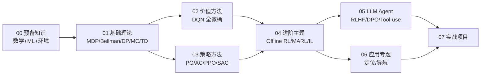

# RL_Agents：从理论到实战的强化学习自学仓库

一个系统化的强化学习（Reinforcement Learning）学习资料仓库，覆盖经典理论、深度 RL 算法、LLM Agent 时代的演进，以及在**定位与导航**方向的应用专题与可运行示例。

---

## 一、内容概览

仓库按"由浅入深 + 一个应用专题"的方式组织：



| 章节 | 内容 | 形式 |
|------|------|------|
| [00_prerequisites](./00_prerequisites/) | 数学/ML/PyTorch/Gymnasium 速通 | md |
| [01_foundations](./01_foundations/) | MDP / Bellman / DP / MC / TD / Q-learning / SARSA | md + ipynb |
| [02_value_based](./02_value_based/) | DQN / Double / Dueling / PER / Rainbow | md + ipynb |
| [03_policy_based](./03_policy_based/) | REINFORCE / A2C / PPO / DDPG / TD3 / SAC | md + ipynb |
| [04_advanced](./04_advanced/) | Model-based / Offline RL / MARL / IRL / Meta-RL | md |
| [05_llm_agents](./05_llm_agents/) | Agent 概念 / ReAct / RLHF / DPO / GRPO / 框架 | md |
| [06_localization_rl](./06_localization_rl/) | RL 在 GNSS / 地图匹配 / 传感器融合 / 路径规划中的应用 | md + ipynb |
| [07_projects](./07_projects/) | 5 个递进式实战项目 | code |
| [resources](./resources/) | 经典书籍/课程/论文/工具索引 | md |

---

## 二、关于 "06 应用专题：定位 / 导航"

这一章独立成节，用具体行业问题展示 RL 如何与传统方法（卡尔曼滤波、HMM、A*）结合：

| 传统问题 | 痛点 | RL 切入方式 | 代表论文 |
|---------|------|------------|---------|
| GNSS 城市峡谷定位 | 多径、NLOS 难以建模 | DRL 端到端"修正策略" | *Improving GNSS Positioning Correction Using DRL with Adaptive Reward* (NAVIGATION 2024) |
| 在线地图匹配 | HMM 在分歧路、密集路网失败 | OMDP + RL 增量决策 | **RLOMM** (arxiv 2502.06825) |
| 多传感器融合 | KF 噪声协方差难调 | RL 自适应噪声/选择传感器 | Adaptive Kalman with RL |
| 轨迹预测 / 规划 | 复杂场景泛化差 | RL + 模仿学习 + 世界模型 | **WorldRFT** (2025), Reinforced Imitative Planning |

如果你不关心定位领域，可以跳过这一章，前 5 章 + 项目仍然是完整的 RL 学习链路。

---

## 三、推荐学习资源

### 必读书籍
1. **Sutton & Barto《Reinforcement Learning: An Introduction》** （[免费 PDF](http://incompleteideas.net/book/the-book-2nd.html)）—— 圣经，前 8 章必读
2. **《动手学强化学习》张伟楠**（中文，配 Jupyter 代码：https://hrl.boyuai.com/）
3. **《深度强化学习》王树森**（B 站有视频）

### 高质量课程
1. **Hugging Face Deep RL Course**：https://huggingface.co/learn/deep-rl-course
2. **OpenAI Spinning Up**：https://spinningup.openai.com/
3. **David Silver UCL RL Course**
4. **CS285 (Sergey Levine, Berkeley)**

### 必备工具栈
- **Python 3.10+ / PyTorch 2.x**
- **[Gymnasium](https://gymnasium.farama.org/)**
- **[Stable-Baselines3](https://stable-baselines3.readthedocs.io/)**
- **[CleanRL](https://github.com/vwxyzjn/cleanrl)** 单文件实现，最适合学习
- **TensorBoard / Weights & Biases**

---

## 四、如何使用本仓库

```bash
git clone https://github.com/Mocha0724/RL_Agents.git
cd RL_Agents

conda create -n rl python=3.10 -y
conda activate rl
pip install -r requirements.txt

jupyter lab
```

**建议节奏**（约 3-4 个月，每周 8-10 小时）：
1. **第 1-2 周**：刷完 `00` + `01`，跑通 GridWorld Q-learning
2. **第 3-5 周**：`02` + `03`，独立复现 DQN/PPO
3. **第 6-7 周**：`04` 选读 + `05` 全读
4. **第 8-12 周**：选读 `06` 应用专题，配合 `07` 项目穿插进行

---

## 五、约定

- 公式用 LaTeX（`$...$` / `$$...$$`）
- 算法图用 Mermaid（GitHub 直接渲染）
- 代码风格：Black + isort
- 每个 md 末尾给出「**进一步阅读**」与「**思考题**」
- 重要论文统一收录在 [resources/papers.md](./resources/papers.md)

---

**License**: MIT
