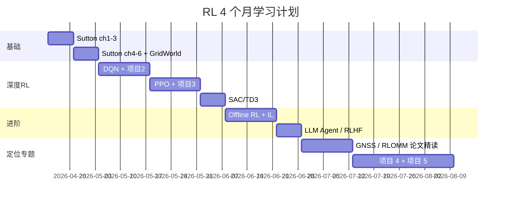

# 推荐课程

## 视频课程

| 课程 | 讲师/平台 | 推荐理由 |
|-----|---------|---------|
| **Hugging Face Deep RL Course** | HF | 免费 + 实战 + 证书 [link](https://huggingface.co/learn/deep-rl-course) |
| **CS285: Deep RL** | Sergey Levine, Berkeley | 前沿 + 难度高 [B 站搬运](https://www.bilibili.com/) |
| **David Silver UCL RL Course** | DeepMind | 经典理论入门 [YouTube](https://www.davidsilver.uk/teaching/) |
| **Coursera RL Specialization** | UAlberta (Sutton 团队) | 4 门课系统讲 |
| **王树森 深度强化学习** | B 站 | 中文，公式清晰 |
| **EasyRL（蘑菇书）** | datawhale | 中文教程 + 代码 [开源](https://datawhalechina.github.io/easy-rl/) |

## 在线交互资源

| 资源 | 用途 |
|-----|------|
| **OpenAI Spinning Up** | 算法实现 + 论文导读 [link](https://spinningup.openai.com/) |
| **CleanRL** | 单文件实现，最适合学习 [github](https://github.com/vwxyzjn/cleanrl) |
| **Stable-Baselines3 docs** | 工业级 API 学习 |
| **Gymnasium docs** | 环境 API |
| **PettingZoo** | MARL 环境 |

## 推荐学习节奏

## 学习方法建议

1. **看一遍 → 做一遍 → 写一遍**：看视频 / 跑 demo / 写读书笔记或博客
2. **代码先行**：能跑通比看懂更重要
3. **多 seed 实验**：RL 方差大，学会用统计眼光看结果
4. **加入社群**：Discord (HF Deep RL 课程)、知乎、B 站评论区
